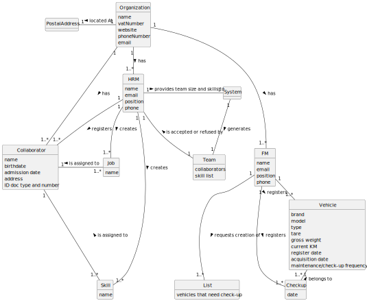

# OO Analysis

## Rationale to identify domain conceptual classes

### _Conceptual Class Category List_

**Business Transactions**

* 

---

**Transaction Line Items**

* 

---

**Product/Service related to a Transaction or Transaction Line Item**

* 

---

**Transaction Records**

* 

---  

**Roles of People or Organizations**

* Human Resources Manager (HRM)
* Fleet Manager (FM)
* Collaborator

---

**Places**

* Organization

---

**Noteworthy Events**

* Maintencance/Check-up Date

---

**Physical Objects**

* Vehicle

---

**Descriptions of Things**

* 

---

**Catalogs**

* Skill Catalog

---

**Containers**

* Collaborator

---

**Elements of Containers**

* Job
* Skill

---

**Organizations**

* Organization

---

**Other External/Collaborating Systems**

* Supplier System

---

**Records of finance, work, contracts, legal matters**

* Employment Contract
* Work Order

---

**Financial Instruments**

* Budget

---

**Documents mentioned/used to perform some work/**

* Team Proposal
* List of vehicles that need check-up

---

## Rationale to identify associations between conceptual classes

| Concept (A) 		 |          Association   	           |                         Concept (B) |
|----------------|:----------------------------------:|------------------------------------:|
| Organization   |              has		 	               |                                 HRM |
| Organization   |              has		 	               |                                  FM |
| Organization   |              has		 	               |                        Collaborator |
| HRM            |      registers and manages	 	      |                        Collaborator |
| HRM            |             creates 	              |                               Skill |
| HRM            |             creates 	              |                                 Job |
| HRM            |         accepts/refuses 	          |                                Team |
| HRM            |  provides team size and skills to  |                              System |
| Collaborator   |          assigned with 	           |                               Skill |
| Collaborator   |          assigned with 	           |                                 Job |
| FM             |       registers and manages        |                             Vehicle |
| FM             |        requests creation of        | List of vehicles that need check-up |
| Vehicle        |                has                 |                       Check-up date |
| Vehicle        | is physically or logically part of | List of vehicles that need check-up |
| System         |             generates              |                                Team |
| System         |             generates              | List of vehicles that need check-up |

## Domain Model

