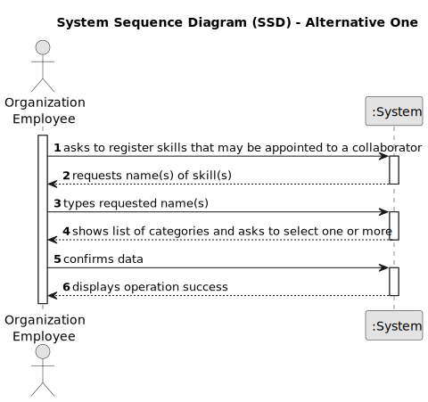

# US001 - Create a Skill

## 1. Requirements Engineering

### 1.1. User Story Description

As a Human Resources Manager (HRM), I want to register skills that a collaborator may have.

### 1.2. Customer Specifications and Clarifications 

**From the specifications document:**

>	Each skill is characterized only by its name.

>	As long as it is not attributed to a collaborator, access to the skill is exclusive to the employees of the respective organization. 

**From the client clarifications:**

> **Question:** Can the skill be immediately attributed to a collaborator?
>
> **Answer:** No. The skill is to be created only.

> **Question:** What data is necessary to create a skill?
>
> **Answer:** At the moment, the skill is only a name.

### 1.3. Acceptance Criteria

* **AC1:** At least one skill name must be inputted.
* **AC2:** When creating a skill with a name that already exists, the system must reject such operation and the user must be able to modify the typed name.

### 1.4. Found out Dependencies

* n/a

### 1.5 Input and Output Data

**Input Data:**

* Typed data:
    * name of skill

**Output Data:**

* (In)Success of the operation

### 1.6. System Sequence Diagram (SSD)

#### Alternative One

### 1.7 Other Relevant Remarks

* The created skill stays in a "not attributed" state in order to distinguish from "attributed" skills.