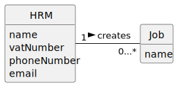

# US002 - Create a Job

## 2. Analysis

### HRM (Human Resources Manager):
Responsible for creating jobs.
Attributes include name, vatNumber, phoneNumber, and email.

### Job:
Can be created by an HRM and assigned to one or more Collaborators.
Attributes include only the name.

### 2.1. Relevant Domain Model Excerpt 

### 2.2. Other Remarks

n/a