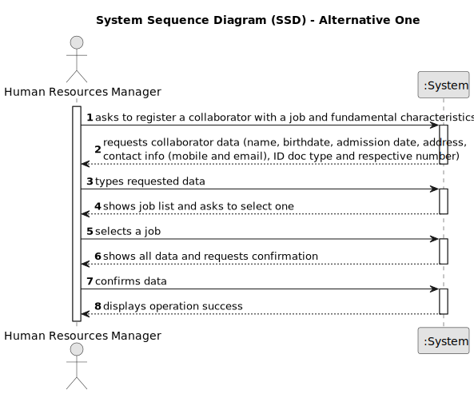

# US003 - Register a collaborator 

## 1. Requirements Engineering

### 1.1. User Story Description

As an HRM, I want to register a collaborator with a job and fundamental characteristics.

### 1.2. Customer Specifications and Clarifications 

**From the specifications document:**

>	Each collaborator is characterized by having a name, birthdate, admission date, address, contact info (mobile and email), ID doc type and a respective number, all of which should be provided by the HRM.

>	The job attributed to the collaborator has to be one created in US02.

**From the client clarifications:**

> **Question:** Should the system able the HRM to insert multiple collaborators in one interaction before saving them?
>
> **Answer:** It's not required to do so.

### 1.3. Acceptance Criteria

* **AC1:** The fundamental characteristics must be inputted by the HRM.
* **AC2:** At least one collaborator must be registered

### 1.4. Found out Dependencies

* There is a dependency on "US002 - Create a Job" as there must be at least one job to register the collaborator with.

### 1.5 Input and Output Data

**Input Data:**

* Typed data:
    * a name
    * a birthdate 
    * an admission date
    * an address
    * an email
    * a phone number
    * a taxpayer number
    * an ID document type and respective number
	
* Selected data:
    * a job

**Output Data:**

* List of existing jobs
* (In)Success of the operation
* Error messages in case of invalid operations (e.g. non-existent skill)

### 1.6. System Sequence Diagram (SSD)

**_Other alternatives might exist._**

#### Alternative One

#### Alternative Two

### 1.7 Other Relevant Remarks

* Multiple collaborators can be introduced at once.