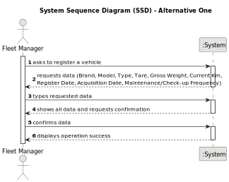

# US006 - Register a Vehicle 

## 1. Requirements Engineering

### 1.1. User Story Description

As an FM, I wish to register a vehicle including Brand, Model, Type, Tare, Gross Weight, Current Km, Register Date, Acquisition Date, Maintenance/Check-up Frequency (in Kms).

### 1.2. Customer Specifications and Clarifications 

**From the specifications document:**

>	Each registered vehicle contains their Brand, Model, Type, Tare, Gross Weight, Current Km, Register Date, Acquisition Date, Maintenance/Check-up Frequency (in Kms).

**From the client clarifications:**

> **Question:** What should the vehicles be identified by?
>
> **Answer:** Their plate ID.

### 1.3. Acceptance Criteria

* **AC1:** All required data must be inputted.

### 1.4. Found out Dependencies

* n/a

### 1.5 Input and Output Data

**Input Data:**

* Typed data:
    * a brand name
    * a model
    * a type
    * a tare
    * a gross weight 
    * the current Km 
    * the register and acquisition Dates
    * the maintenance/check-up frequency

**Output Data:**

* (In)Success of the operation

### 1.6. System Sequence Diagram (SSD)

**_Other alternatives might exist._**

#### Alternative One

### 1.7 Other Relevant Remarks

* n/a