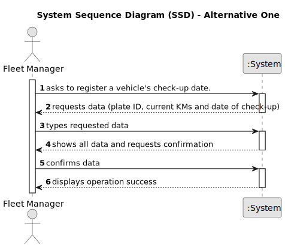

# US007 - Register a Vehicle's Check-up 

## 1. Requirements Engineering

### 1.1. User Story Description

As an FM, I wish to register a vehicle’s check-up.

### 1.2. Customer Specifications and Clarifications 

**From the specifications document:**

>	The data inputted must be the plate ID, the date of the check-up, and the current KMs.

**From the client clarifications:**

> **Question:** What is the unit of measurement used to estimate the check-up frequency (Kms, months, etc.)?
>
> **Answer:** In real context all could be considered, in the scope of this project just Kms will be considered.

> **Question:** Can a vehicle have more than one check-up date?
>
> **Answer:** Yes.

> **Question:** In what format is the date introduced?
> 
> **Answer:** In the European format, that is, DD-MM-YYYY.

### 1.3. Acceptance Criteria

* **AC1:** The fundamental characteristics must be inputted by the FM.
* **AC2:** The date of the Check-Up must be in the following format:

### 1.4. Found out Dependencies

* There is a dependency on "US006 - Register a Vehicle" as there must be at least one vehicle already registered.

### 1.5 Input and Output Data

**Input Data:**

* Typed data:
    * the vehicle ID
    * the date of the check-up
    * the current KMs of the vehicle

**Output Data:**
* (In)Success of the operation

### 1.6. System Sequence Diagram (SSD)

**_Other alternatives might exist._**

#### Alternative One

### 1.7 Other Relevant Remarks

* n/a