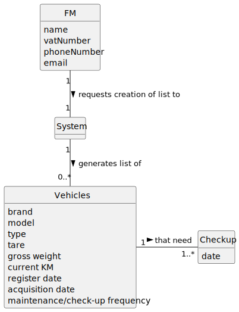

# US008 - List Vehicles that need Check-Up

## 2. Analysis

### FM (Fleet Manager):
Asks the System to generate list of vehicles that need check-up.
Attributes include name, vatNumber, phoneNumber, and email.

### System:
Generates list of vehicles that need check-up, after request from the FM.

### Vehicle:
Registered by the FM, may be included in the list of vehicles that need check-up.
Attributes include Brand, Model, Type, Tare, Gross Weight, Current Km, Register Date, Acquisition Date, Maintenance/Check-up Frequency (in Kms), and Check-up date.

### 2.1. Relevant Domain Model Excerpt 

### 2.2. Other Remarks
n/a