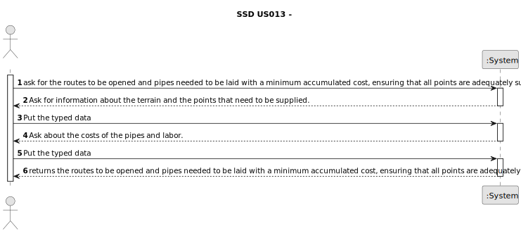

# US013 -

## 1. Requirements Engineering

### 1.1. User Story Description

- As a GSM, I want to apply an algorithm that returns the routes
  to be opened and pipes needed to be laid with a minimum accumulated
  cost, ensuring that all points are adequately supplied.

### 1.2. Customer Specifications and Clarifications

**From the specifications document:**

>

**From the client clarifications:**

> **Question:**
>
> **Answer:**

### 1.3. Acceptance Criteria

1. All implemented procedures must only use primitive operations, and not existing functions in JAVA libraries.

### 1.4. Found out Dependencies

* n/a

### 1.5 Input and Output Data

**Input Data:**

* Typed data:
  * Information about the terrain
  * The points that need to be supplied 
  * The costs of the pipes and labor.

* Selected data:
  No selected data.

**Output Data:**

* (In)Success of the operation

### 1.6. System Sequence Diagram (SSD)

### 1.7 Other Relevant Remarks

