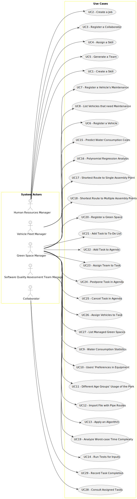

# Use Case Diagram (UCD)

**In the scope of this project, there is a direct relationship of _1 to 1_ between Use Cases (UC) and User Stories (US).**

However, be aware, this is a pedagogical simplification. On further projects and course units there may also exist _1 to N **and/or** N to 1_ relationships between UC and US.

**Insert below the Use Case Diagram in a SVG format**

**For each UC/US, it must be provided evidences of applying main activities of the software development process (requirements, analysis, design, tests and code). Gather those evidences on a separate file for each UC/US and set up a link as suggested below.**

# Use Cases / User Stories

| UC/US | Description                                               |                   
|:------|:----------------------------------------------------------|
| US001 | [Create a Skill](../us001/Readme.md)                      |
| US002 | [Create a Job](../us002/Readme.md)                        |
| US003 | [Register a Collaborator](../us003/Readme.md)             |
| US004 | [Assign a Skill](../us004/Readme.md)                      |
| US005 | [Generate a Team](../us005/Readme.md)                     |
| US006 | [Register a Vehicle](../us006/Readme.md)                  |
| US007 | [Register a Vehicle's Maintenance](../us007/Readme.md)    |
| US008 | [List Vehicles that need Maintenance](../us008/Readme.md) |
| US020 | [Register A Green Space](../us020/Readme.md)              |
| US021 | [Add an Entry to the To-Do List](../us021/Readme.md)      |
| US022 | [Add an Entry to the Agenda](../us022/Readme.md)          |
| US023 | [Assign a Team](../us023/Readme.md)                       |
| US024 | [Postpone an Entry](../us024/Readme.md)                   |
| US025 | [Cancel an Entry](../us025/Readme.md)                     |
| US026 | [Assign a Vehicle](../us026/Readme.md)                    |
| US027 | [List Managed Green Spaces](../us027/Readme.md)           |
| US028 | [Consult Tasks](../us028/Readme.md)                       |
| US029 | [Record Completion of a Task](../us029/Readme.md)         |

