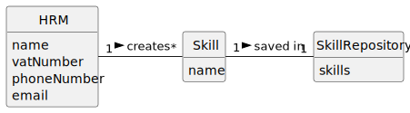

# US001 - Create a Skill 

## 2. Analysis

### HRM (Human Resources Manager):
Responsible for creating skills.
Attributes include name, vatNumber, phoneNumber, and email.

### Skill:
Can be created by an HRM and is then assigned to one or more Collaborators.
Attributes include only the name.

### Skill Repository:
Stores created skills.

### 2.1. Relevant Domain Model Excerpt 

### 2.2. Other Remarks

n/a