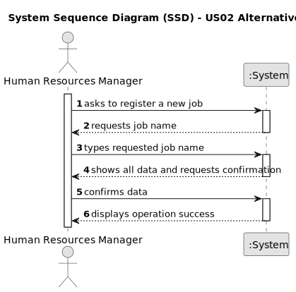

# US002 - Create a Job 

## 1. Requirements Engineering

### 1.1. User Story Description

As an HRM, I want to register a job that a collaborator need to have.

### 1.2. Customer Specifications and Clarifications 

**From the specifications document:**

>	Each job registered should have only a name.

**From the client clarifications:**

> **Question:** After register a job, should a message (sucess or failure) or a resume of the register appear?
>
> **Answer:** The UX/UI is up to dev teams.

> **Question:** Is it relevant to associate a specific area or sector to the job?
>
> **Answer:** It is not necessary, as there are no US that might make use of that.

### 1.3. Acceptance Criteria

* **AC1:** There must be at least one job name inputted.
* **AC2:** A job name can’t have special characters or digits.

### 1.4. Found out Dependencies

* n/a

### 1.5 Input and Output Data

**Input Data:**

* Typed data:
    * a name for the job

**Output Data:**

* (In)Success of the operation

### 1.6. System Sequence Diagram (SSD)

#### Alternative One

### 1.7 Other Relevant Remarks

* n/a