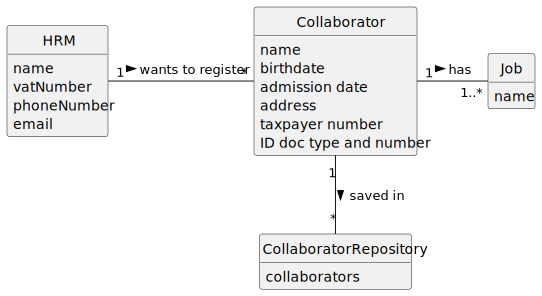

# US003 - Register a Collaborator 

## 2. Analysis

### HRM (Human Resources Manager):
Responsible for registering and managing collaborators.
Attributes include name, vatNumber, phoneNumber, and email.

### Collaborator:
Is registered by HRM(s).
Attributes include name, birthdate, admission date, address, contact info (mobile and email), ID doc type and a respective number.

### Job:
Can be created by an HRM and assigned to one or more Collaborators.
Attributes include only the name.

### Collaborator Repository:
Stores registered collaborators.

### 2.1. Relevant Domain Model Excerpt 

### 2.2. Other Remarks

n/a