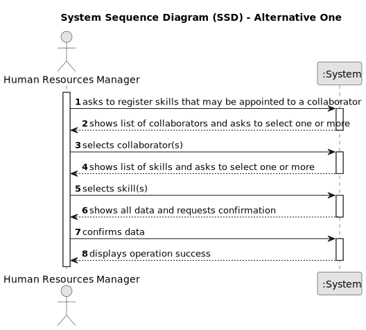

# US004 - Assign a Skill

### 1.1. User Story Description
As a Human Resources Manager (HRM), I want to assign one or more skills to a collaborator to effectively manage and utilize the workforce's capabilities.

### 1.2. Customer Specifications and Clarifications

From the specifications document:

>	Each collaborator can be associated with multiple skills.

>	A skill can only be assigned if it is not already attributed to the collaborator.

From the client clarifications:

>	**Question:** Can a skill be removed from a collaborator?
>
>	**Answer:** Yes, but that is in a different user story.

>	**Question:** How is the collaborator identified for skill assignment?
>
>	**Answer:** The collaborator is identified by their employee ID/Vatnumber .

### 1.3. Acceptance Criteria

* **AC1:** The collaborator must exist in the system.
* **AC2:** The skill to be assigned must exist in the system.
* **AC3:** A skill can be assigned to a collaborator only if it is not already assigned to them.
* **AC4:** The system should allow assignment of multiple skills in a single operation.

### 1.4. Found out Dependencies
* There must be a predefined list of skills available in the system, therefore there is a dependency on "US001 - Create a Skill".
* Each collaborator must have a unique identifier, therefore there is a dependency  on "US003 - Register a Collaborator".

### 1.5 Input and Output Data

**Input Data:**

* Selected data:
    * Collaborator's employee ID or Vatnumber

* Typed data:
    * Names of skills to be assigned

**Output Data:**

* Operation Successful or Operation not Succesfull
* Confirmation of successful skill assignment
* Error messages in case of invalid operations (e.g., skill already assigned, non-existent collaborator or skill)

### 1.6. System Sequence Diagram (SSD)

To visualize the process of assigning skills to a collaborator, we can consider two alternatives for the system sequence diagram (SSD).

Alternative One: Sequential Assignment
HRM selects one or more skills from the list of available skills.
HRM selects a collaborator by their employee ID/Vatnumber.
System checks each selected skill against the collaborator's current skills.
System assigns new skills to the collaborator.
System provides confirmation of successful operation.

Alternative Two: 
HRM selects a collaborator by their employee ID.
System validates collaborator existence.
HRM selects multiple skills from the list of available skills.
System performs a  check to ensure none of the selected skills are already assigned to the collaborator.
System assigns all valid skills in one operation.
System provides confirmation of successful operation and reports any skills not assigned due to pre-existing assignment.

#### Alternative One

### 1.7 Other Relevant Remarks

* Skills once assigned can be removed or modified based on future user stories focusing on skill management for collaborators.
* The system might need to support additional functionalities like viewing a collaborator's currently assigned skills or modifying the skill assignments.

