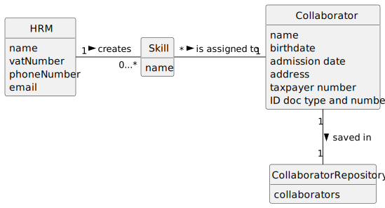

# US004 - Assign a Skill 

## 2. Analysis
### 2.1. Relevant Domain Model Excerpt

### HRM (Human Resources Manager):
Responsible for creating skills.
Attributes include name, vatNumber, phoneNumber, and email.

### Skill:
Can be created by an HRM and assigned to one or more Collaborators.
Attributes include only the name.

### Collaborator:
Receives skill assignments.
Attributes include name, birthdate, admission date, address, contact info (mobile and email), taxpayer number ID doc type and a respective number.

### Collaborator:
Stores saved/updated collaborators

### 2.2. System Interactions Based on Domain Model

Validation of HRM's Authority: The system should verify that the HRM has the authority to assign skills.

Skill Selection: The HRM must be able to select from a list of skills that they have created or that are available in the system.

Collaborator Selection: The HRM needs to identify and select a collaborator using their unique identifier (e.g., vatNumber or employeeID).

Assignment of Skills: The system should handle the assignment of skills to the collaborator. It must ensure that the skill isn't already assigned to the collaborator, per AC3.

Update of Collaborator’s Skills: Once a skill is successfully assigned, the currentSkills attribute of the Collaborator should be updated.

Confirmation and Error Handling: The system should confirm the successful assignment of skills or provide an error message if the operation is invalid.

### 2.5. User Interface Considerations

There should be a user interface component that allows HRMs to easily perform skill assignments.

The interface might include dropdowns or search fields to select collaborators and skills, as well as confirmation dialogs to finalize the operations.

