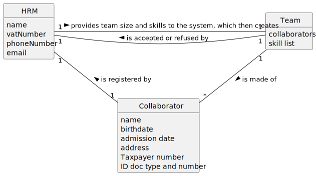

# US005 - Generate a Team 

## 2. Analysis

### HRM (Human Resources Manager):
Asks the System to create a Team.
Specifies the team size (max. and min.) and recommended skills to the System.
Attributes include name, vatNumber, phoneNumber, and email.

### Collaborator:
Is registered by HRM(s).
Attributes include name, birthdate, admission date, address, contact info (mobile and email), ID doc type and a respective number.
May or may not be assigned to a team.

### Team:
Generated by the System.
Consists of collaborators and the skills introduced by the HRM.

### 2.1. Relevant Domain Model Excerpt 

### 2.2. Other Remarks

n/a