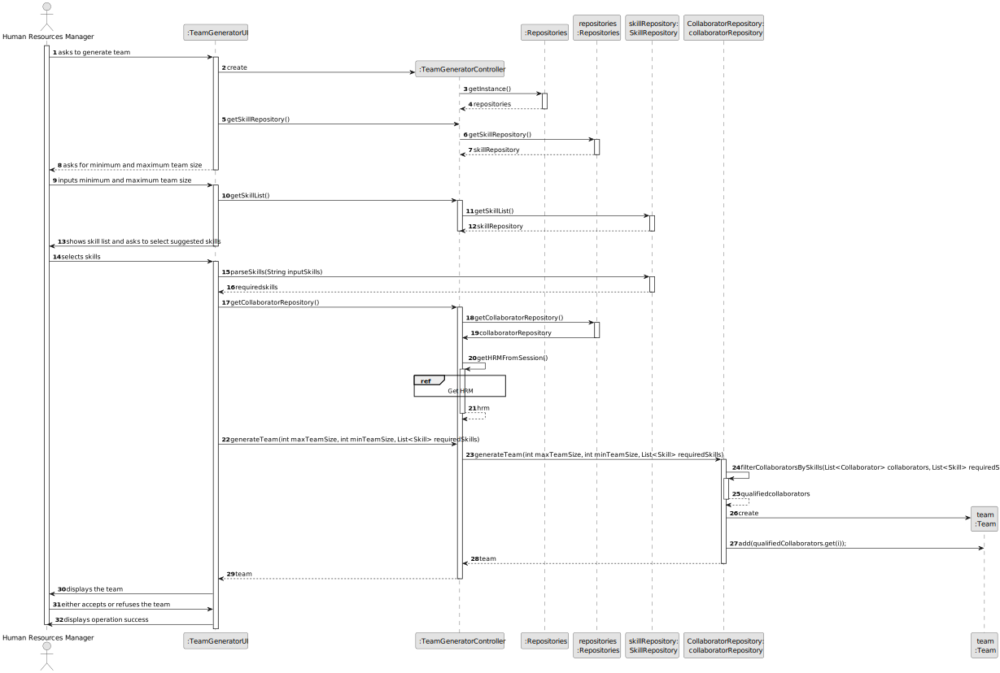
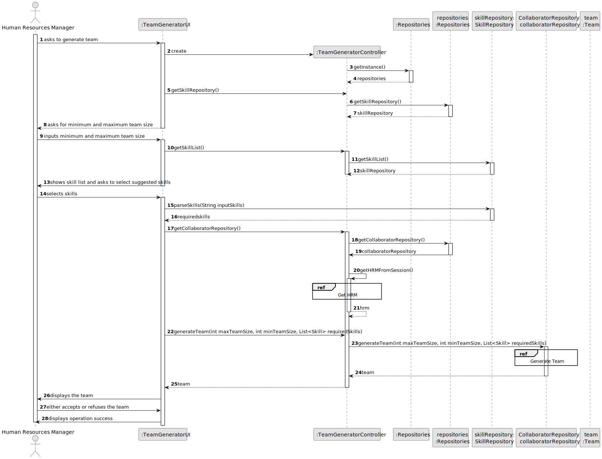
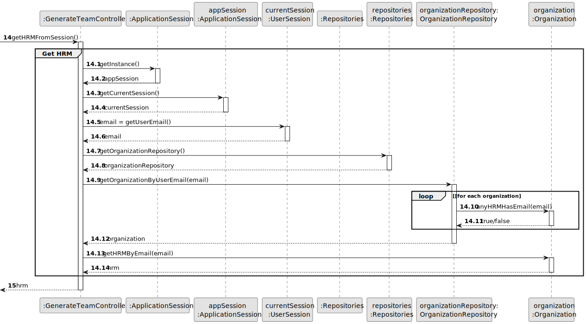
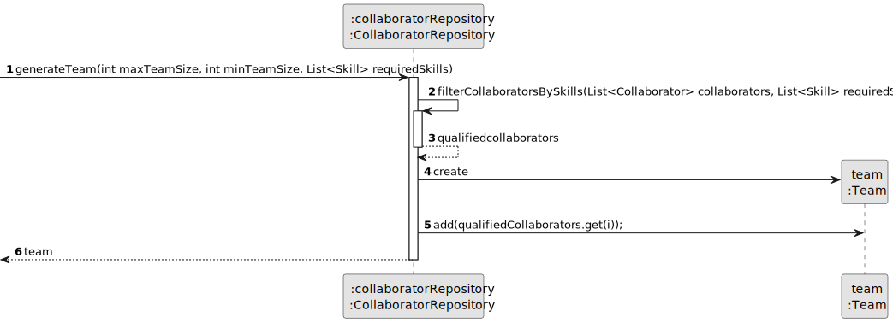
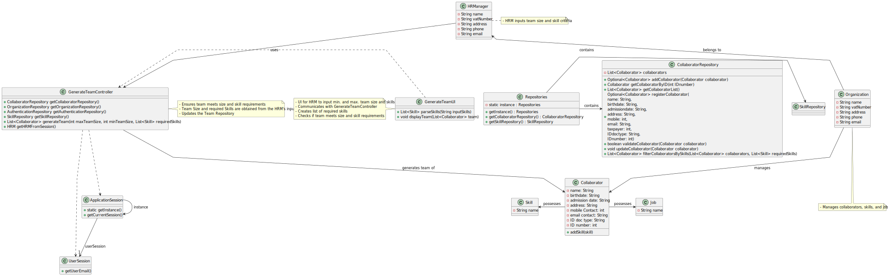

# US005 - Generate a Team 

## 3. Design - User Story Realization 

### 3.1. Rationale

_**Note that SSD - Alternative One is adopted.**_

| Interaction ID | Question: Which class is responsible for...  | Answer                  | Justification (with patterns)                                                                                 |
|:---------------|:---------------------------------------------|:------------------------|:--------------------------------------------------------------------------------------------------------------|
| Step 1         | ... interacting with the actor?              | :GenerateTeamUI         | Pure Fabrication: there is no reason to assign this responsibility to any existing class in the Domain Model. |
|                | ... coordinating the team generation?        | :GenerateTeamController | Controller                                                                                                    |
|                | ... instantiating a new team?                | :CollaboratorRepository | Creator (Rule 1): in the Domain Model, CollaboratorRepository has a Team.                                     |
|                | ... retrieving user session data?            | :ApplicationSession     | IE: responsible for managing application session data.                                                        |
| Step 2         | ... checking team size?                      | :GenerateTeamController | Controller                                                                                                    |
| Step 3         | ... saving the inputted data?                | :CollaboratorRepository | IE: CollaboratorRepository class holds data relevant to team creation.                                        |
| Step 4         | ... knowing the required skills?             | :GenerateTeamController | Controller                                                                                                    |
| Step 5         | ... saving the selected skills?              | :CollaboratorRepository | IE: CollaboratorRepository class holds data relevant to team creation.                                        |
| Step 6         | ... retrieving collaborator data?            | :CollaboratorRepository | Repository: responsible for accessing collaborator data.                                                      |
|                | ... selecting suitable collaborators?        | :CollaboratorRepository | Repository: responsible for selecting collaborators based on criteria.                                        |
|                | ... adding selected collaborators?           | :CollaboratorRepository | IE: CollaboratorRepository class manages its own collaborators.                                               |
|                | ... validating all data (global validation)? | :CollaboratorRepository | IE: CollaboratorRepository class validates team proposal data.                                                |
|                | ... showing the generated team?              | :GenerateTeamUI         | IE: UI is responsible for user interactions                                                                   |
| Step 7         | ... receiving the user's input?              | :GenerateTeamUI         | IE: UI is responsible for user interactions                                                                                                              |
| Step 8         | ... informing operation success?             | :GenerateTeamUI         | IE: UI is responsible for user interactions                                                                   |

### Systematization ##

According to the taken rationale, the conceptual classes promoted to software classes are: 

* CollaboratorRepository

Other software classes (i.e. Pure Fabrication) identified: 

* GenerateTeamUI  
* GenerateTeamController

## 3.2. Sequence Diagram (SD)

_**Note that SSD - Alternative One is adopted.**_

### Full Diagram

This diagram shows the full sequence of interactions between the classes involved in the realization of this user story.

### Split Diagrams

The following diagram shows the same sequence of interactions between the classes involved in the realization of this user story, but it is split in partial diagrams to better illustrate the interactions between the classes.

It uses Interaction Occurrence (a.k.a. Interaction Use).

### Partial Diagrams

**Get HRM**

**Generate Team**

## 3.3. Class Diagram (CD)

