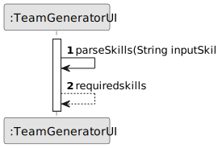
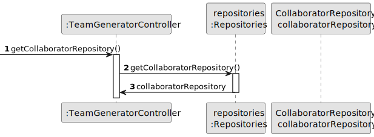

# US005 - Generate a Team 

## 3. Design - User Story Realization 

### 3.1. Rationale

_**Note that SSD - Alternative One is adopted.**_

| Interaction ID | Question: Which class is responsible for...  | Answer                   | Justification (with patterns)                                                                                 |
|:---------------|:---------------------------------------------|:-------------------------|:--------------------------------------------------------------------------------------------------------------|
| Step 1         | ... interacting with the actor?              | :TeamGeneratorUI         | Pure Fabrication: there is no reason to assign this responsibility to any existing class in the Domain Model. |
|                | ... coordinating the team generation?        | :TeamGeneratorController | Controller                                                                                                    |
|                | ... instantiating a new team?                | :Organization            | Creator (Rule 1): in the Domain Model, Organization has a Team.                                               |
|                | ... retrieving user session data?            | :ApplicationSession      | IE: responsible for managing application session data.                                                        |
|                | ... accessing organization data?             | :Organization            | IE: Organization class encapsulates its own data.                                                             |
| Step 2         | ... checking team size?                      | :TeamGeneratorController | Controller                                                                                                    |
| Step 3         | ... saving the inputted data?                | :Organization            | IE: Organization class holds data relevant to team creation.                                                  |
| Step 4         | ... knowing the required skills?             | :TeamGeneratorController | Controller                                                                                                    |
| Step 5         | ... saving the selected skills?              | :Organization            | IE: Organization class holds data relevant to team creation.                                                  |
| Step 6         |                                              |                          |                                                                                                               |
| Step 7         | ... retrieving collaborator data?            | :CollaboratorRepository  | Repository: responsible for accessing collaborator data.                                                      |
|                | ... selecting suitable collaborators?        | :CollaboratorRepository  | Repository: responsible for selecting collaborators based on criteria.                                        |
|                | ... adding selected collaborators?           | :Organization            | IE: Organization class manages its own collaborators.                                                         |
|                | ... validating all data (global validation)? | :Organization            | IE: Organization class validates team proposal data.                                                          |
|                | ... validating all data (local validation)?  | Task                     | IE: owns its data                                                                                             |
| Step 8         | ... informing operation success?             | :TeamGeneratorUI         | Pure Fabrication: UI is responsible for user interactions and feedback.                                       |

### Systematization ##

According to the taken rationale, the conceptual classes promoted to software classes are: 

* Organization
* Team

Other software classes (i.e. Pure Fabrication) identified: 

* TeamGeneratorUI  
* TeamGeneratorController

## 3.2. Sequence Diagram (SD)

_**Note that SSD - Alternative One is adopted.**_

### Full Diagram

This diagram shows the full sequence of interactions between the classes involved in the realization of this user story.

### Split Diagrams

The following diagram shows the same sequence of interactions between the classes involved in the realization of this user story, but it is split in partial diagrams to better illustrate the interactions between the classes.

It uses Interaction Occurrence (a.k.a. Interaction Use).

### Partial Diagrams

**Get Required Skills**

**Get HRM**

**Get Collaborators**

**Generate Team**

## 3.3. Class Diagram (CD)

