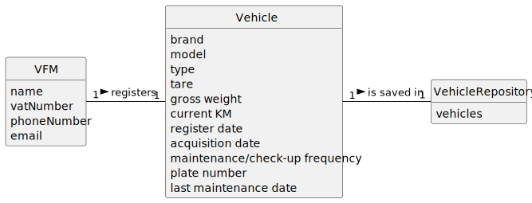

# US006 - Register a vehicle 

## 2. Analysis

### VFM (Vehicle and Equipment Fleet Manager):
Responsible for registering vehicles.
Attributes include name, vatNumber, phoneNumber, and email.

### Vehicle:
Registered by the manager.
Attributes include Brand, Model, Type, Tare, Gross Weight, Current Km, Register Date, Acquisition Date, Maintenance/Check-up Frequency (in Kms), Plante Number and Last Maintenance Date.

### Vehicle Repository:
Stores registered vehicles

### 2.1. Relevant Domain Model Excerpt 

### 2.2. Other Remarks

n/a