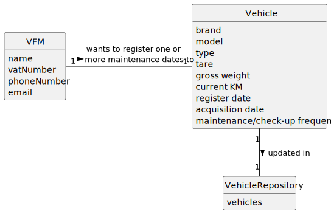

# US007 - Register a Vehicle's Maintenance

## 2. Analysis

### VFM (Vehicle and Equipment Fleet Manager):
Responsible for registering vehicles.
Attributes include name, vatNumber, phoneNumber, and email.

### Maintenance date:
Assigned to a vehicle by the FM.
Is introduced in the format: DD-MM-YYYY

### Vehicle:
Is assigned with a Maintenance date.
Attributes include Brand, Model, Type, Tare, Gross Weight, Current Km, Register Date, Acquisition Date, Maintenance/Check-up Frequency (in Kms).

### 2.1. Relevant Domain Model Excerpt 

### 2.2. Other Remarks
n/a