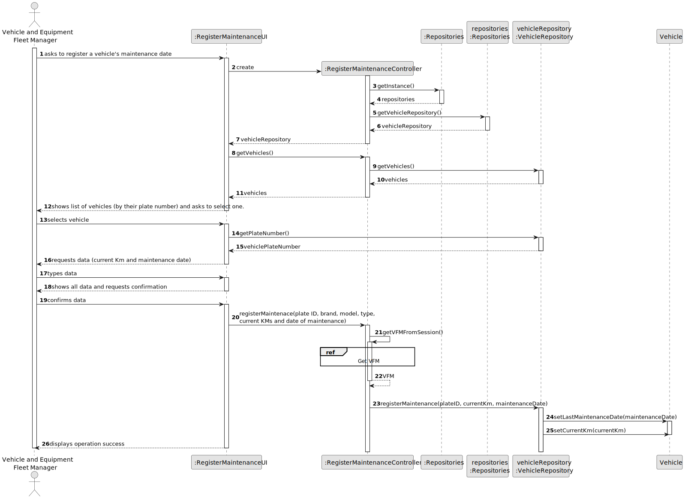

# US007 - Register a Vehicle's Maintenance 

## 3. Design - User Story Realization 

### 3.1. Rationale

_**Note that SSD - Alternative One is adopted.**_

| Interaction ID | Question: Which class is responsible for...          | Answer                | Justification (with patterns)                                                                                 |
|:---------------|:-----------------------------------------------------|:----------------------|:--------------------------------------------------------------------------------------------------------------|
| Step 1  		     | 	... interacting with the actor?                     | RegisterMaintenanceUI | Pure Fabrication: there is no reason to assign this responsibility to any existing class in the Domain Model. |
|                | ... obtaining the vehicle checkup list?              | VehicleRepository     | Information Expert, Pure Fabrication                                                                          |
| 			  		        | 							                                              | Organization          | IE: knows/has its own VFMs                                                                                    |
| 			  		        | 							                                              | VFM                   | IE: knows its own data (e.g. email)                                                                           |
| Step 2  		     | 	... displaying the Vehicle list?                    | RegisterMaintenanceUI | Pure Fabrication                                                                                              |						 
| Step 3  		     | 	 ... validating selected data?                                         | RegisterMaintenanceUI | Pure Fabrication                     |
| Step 4  		     | ... displaying the form for the actor to input data? | RegisterMaintenanceUI | Pure Fabrication                                                                                              |
| Step 5  		     | 	... validating input data?                                            | RegisterMaintenanceUI | Pure Fabrication                     |
| Step 6  		     | 	... displaying all the information before submitting?                 | RegisterMaintenanceUI | Pure Fabrication                     |
| 			  		        | 	... validating all data (global validation)?        | Organization          | IE: knows all its vehicles.                                                                                   |
| Step 7  		     | 	... informing operation success?                    | RegisterMaintenanceUI | IE: is responsible for user interactions.                                                                     | 

### Systematization ##

According to the taken rationale, the conceptual classes promoted to software classes are: 

* Organization
* Vehicle

Other software classes (i.e. Pure Fabrication) identified: 

* RegisterMaintenanceUI  
* CreateTaskController

## 3.2. Sequence Diagram (SD)

_**Note that SSD - Alternative One is adopted.**_

### Full Diagram

This diagram shows the full sequence of interactions between the classes involved in the realization of this user story.

### Split Diagrams

The following diagram shows the same sequence of interactions between the classes involved in the realization of this user story, but it is split in partial diagrams to better illustrate the interactions between the classes.

It uses Interaction Occurrence (a.k.a. Interaction Use).

**Create Maintenance**

**Get Vehicle**

**Get VFM**

## 3.3. Class Diagram (CD)

