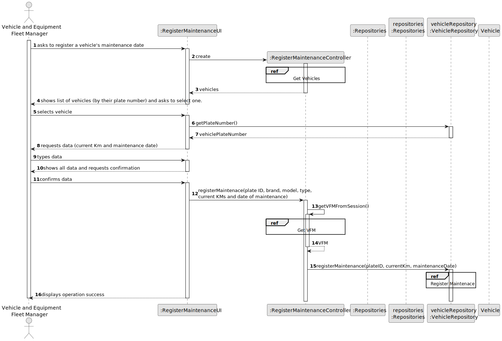
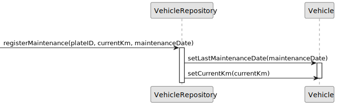
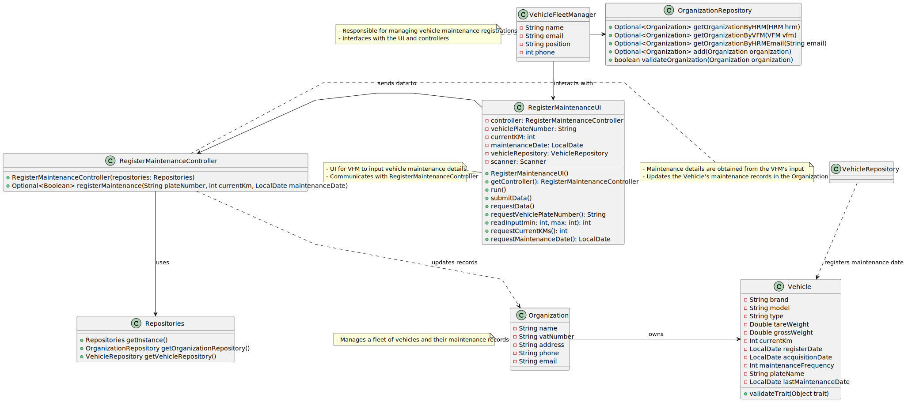

# US007 - Register a Vehicle's Maintenance 

## 3. Design - User Story Realization 

### 3.1. Rationale

_**Note that SSD - Alternative One is adopted.**_

| Interaction ID | Question: Which class is responsible for...        | Answer                        | Justification (with patterns)                                                                                   |
|:---------------|:---------------------------------------------------|:------------------------------|:----------------------------------------------------------------------------------------------------------------|
| Step 1         | ... interacting with the actor?                    | RegisterMaintenanceUI         | Pure Fabrication: there is no reason to assign this responsibility to any existing class in the Domain Model.   |
|                | ... coordinating the US?                           | RegisterMaintenanceController | Controller (UI Pattern): The Controller class orchestrates the user story and interacts with other components.  |
| 			  		        | 	... instantiating a new Vehicle?             | VehicleRepository        | Creator (Rule 1): in the DM VehicleRepository has a Vehicle.                                                    |
|                | ... knowing the user using the system?             | UserSession                   | IE: cf. A&A component documentation.                                                                            |
|                | ... getting the vehicle list?                      | RegisterMaintenanceController | Controller  (UI Pattern): The Controller class orchestrates the user story and interacts with other components. |
| Step 2         | ... showing the vehicle list?                      | RegisterMaintenanceUI         | IE: is responsible for user interactions.                                                                       |
| Step 3         | ... getting the selected vehicle?                  | RegisterMaintenanceUI         | Pure Fabrication: there is no reason to assign this responsibility to any existing class in the Domain Model.   |
| Step 4         | ... requesting the currentKm and Maintenance Date? | RegisterMaintenanceUI         | IE: is responsible for user interactions.                                                                       |
| Step 5         | ... saving the typed data?                         | RegisterMaintenanceUI         | Pure Fabrication: there is no reason to assign this responsibility to any existing class in the Domain Model.   |
| Step 6 		      | 	... showing the data before confirmation?         | RegisterMaintenanceUI         | IE: is responsible for user interactions.                                                                       |
| Step 7 		      | 	... validating all data (local validation)?       | Vehicle                  | IE: object created in US06 has its own data.                                                                    |
| 			  		        | 	... validating all data (global validation)?      | VehicleRepository        | IE: knows all its collaborators.                                                                                | 
|                | ... knowing the user using the system?             | UserSession                   | IE: cf. A&A component documentation.                                                                            |
| Step 8 		      | 	... informing operation success?                  | RegisterVehicleUI        | IE: is responsible for user interactions.                                                                       |
### Systematization ##

According to the taken rationale, the conceptual classes promoted to software classes are: 

* Organization
* Vehicle

Other software classes (i.e. Pure Fabrication) identified: 

* RegisterMaintenanceUI  
* CreateTaskController

## 3.2. Sequence Diagram (SD)

_**Note that SSD - Alternative One is adopted.**_

### Full Diagram

This diagram shows the full sequence of interactions between the classes involved in the realization of this user story.

### Split Diagrams

The following diagram shows the same sequence of interactions between the classes involved in the realization of this user story, but it is split in partial diagrams to better illustrate the interactions between the classes.

It uses Interaction Occurrence (a.k.a. Interaction Use).

**Create Maintenance**

**Get Vehicle**

**Get VFM**

## 3.3. Class Diagram (CD)

