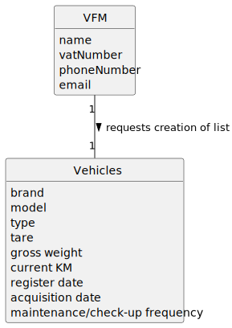

# US008 - List Vehicles that need Maintenance

## 2. Analysis

### VFM (Vehicle and Equipment Fleet Manager):
Asks the System to generate list of vehicles that need maintenance.
Attributes include name, vatNumber, phoneNumber, and email.

### Maintenance date:
Assigned to a vehicle by the FM.
Is introduced in the format: DD-MM-YYYY

### Vehicle:
Registered by the VFM, may be included in the list of vehicles that need maintenance.
Attributes include Brand, Model, Type, Tare, Gross Weight, Current Km, Register Date, Acquisition Date, Maintenance/Check-up Frequency (in Kms), and Check-up date.

### 2.1. Relevant Domain Model Excerpt 

### 2.2. Other Remarks
n/a