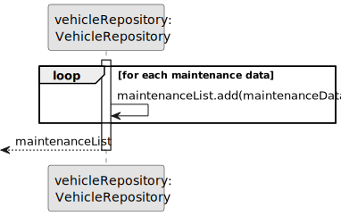
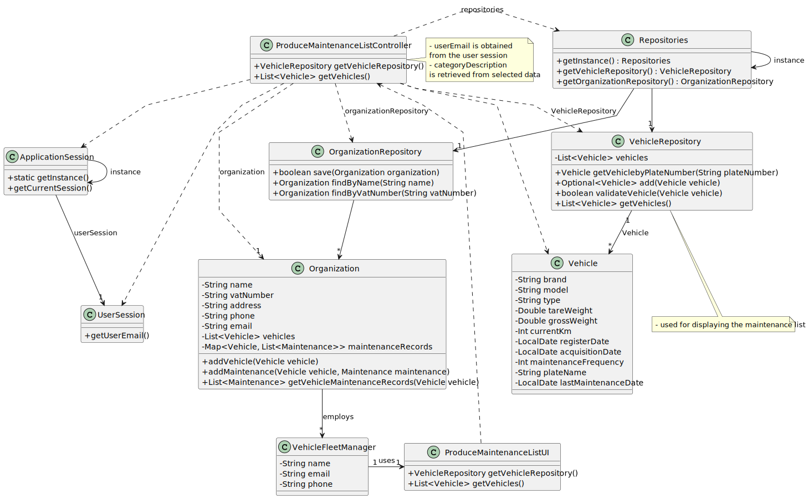

# US008 - List Vehicles that need Maintenance

## 3. Design - User Story Realization 

### 3.1. Rationale

_**Note that SSD - Alternative One is adopted.**_

| Interaction ID | Question: Which class is responsible for...   | Answer                           | Justification (with patterns)                                                                                 |
|:-------------  |:----------------------------------------------|:---------------------------------|:--------------------------------------------------------------------------------------------------------------|
| Step 1  		 | 	... interacting with the actor?              | ProduceMaintenanceListUI         | Pure Fabrication: there is no reason to assign this responsibility to any existing class in the Domain Model. |
| 			  		 | 	... coordinating the US?                     | ProduceMaintenanceListController | Controller                                                                                                    |
| 			  		 | 	... instantiating a new List?                | Organization                     | Creator (Rule 1): in the DM Organization has a List                                                           |
| 			  		 | ... knowing the user using the system?        | UserSession                      | IE: cf. A&A component documentation.                                                                          |
| 			  		 | 							                                       | Organization                     | IE: knows/has its own VFMs                                                                                    |
| 			  		 | 							                                       | VFM                              | IE: knows its own data (e.g. email)                                                                           |
| Step 2  		 | 							                                       |                                  |                                                                                                               |
| Step 3  		 | 	...getting the vehicle parts?                | ProduceMaintenanceListUI         | Pure Fabrication.                                                                                             |
| Step 4  		 | 	...knowing the list categories to show?      | System                           | IE: List Categories are defined by the Administrators.                                                        |
| Step 5  		 | 	... saving the selected category?            | List                             | IE: object created in step 1 is classified in one Category.                                                   |
| Step 6  		 | 							                                       |                                  |                                                                                                               |              
| Step 7  		 | 	... validating all data (local validation)?  | List                             | IE: owns its data.                                                                                            | 
| 			  		 | 	... validating all data (global validation)? | Organization                     | IE: knows all its lists.                                                                                      | 
| 			  		 | 	... saving the created list?                 | List                             | IE: owns all its lists.                                                                                       | 
| Step 8  		 | 	... informing operation success?             | ProduceMaintenanceListUI         | IE: is responsible for user interactions.                                                                     | 

### Systematization ##

According to the taken rationale, the conceptual classes promoted to software classes are: 

* Organization
* List

Other software classes (i.e. Pure Fabrication) identified: 

* ProduceMaintenanceListUI  
* ProduceMaintenanceListController

## 3.2. Sequence Diagram (SD)

_**Note that SSD - Alternative One is adopted.**_

### Full Diagram

This diagram shows the full sequence of interactions between the classes involved in the realization of this user story.

### Split Diagrams

The following diagram shows the same sequence of interactions between the classes involved in the realization of this user story, but it is split in partial diagrams to better illustrate the interactions between the classes.

It uses Interaction Occurrence (a.k.a. Interaction Use).

**Get Vehicle Parts**

**Create List**

**Get VFM**

## 3.3. Class Diagram (CD)

