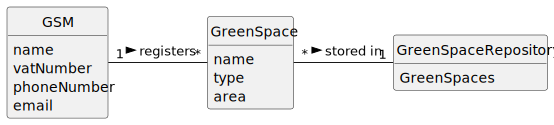

# US020 - Registering a Green Space and Its Area 

## 2. Analysis

### GSM (Green Spaces Manager):
* Responsible for registering Green Spaces.
* Attributes include name, vatNumber, phoneNumber, and email.

### Green Space:
* Can be created by a GSM.
* Attributes include name, type and area.
* 
### Green Space Repository:
* Stores Green Spaces and related information.

### 2.1. Relevant Domain Model Excerpt 

### 2.2. Other Remarks

n/a