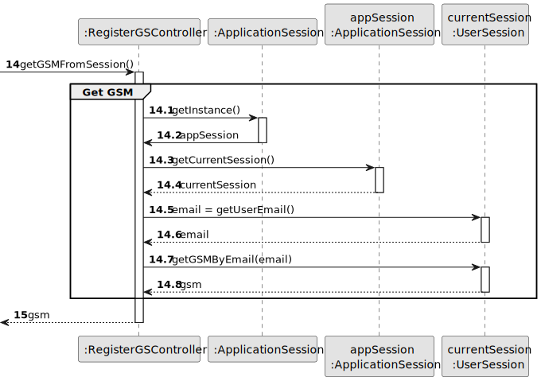
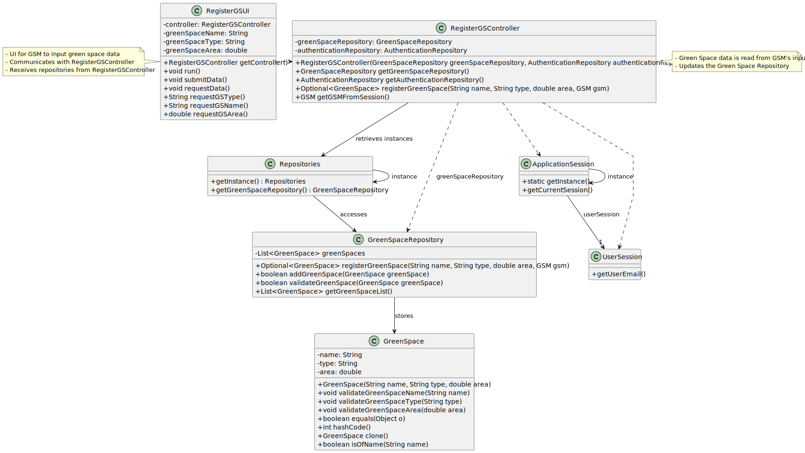

# US020 - Register a Green Space

## 3. Design - User Story Realization 

### 3.1. Rationale

_**Note that SSD - Alternative One is adopted.**_

| Interaction ID | Question: Which class is responsible for...   | Answer               | Justification (with patterns)                                                                                 |
|:---------------|:----------------------------------------------|:---------------------|:--------------------------------------------------------------------------------------------------------------|
| Step 1  		     | 	... interacting with the actor?              | RegisterGSUI         | Pure Fabrication: there is no reason to assign this responsibility to any existing class in the Domain Model. |
| 			  		        | 	... coordinating the US?                     | RegisterGSController | Controller                                                                                                    |
| 			  		        | 	... instantiating a new Green Space?         | GreenSpaceRepository | Creator (Rule 1): in the DM GreenSpaceRepository stores GreenSpaces.                                          |
| 			  		        | ... knowing the user using the system?        | UserSession          | IE: cf. A&A component documentation.                                                                          |
| 			  		        | 							                                       | GSM                  | IE: knows its own data (e.g. email)                                                                           |
| Step 2  		     | 	...showing the types of Green Spaces?						  | RegisterGSUI         | IE: is responsible for all user interactions                                                                  |
| Step 3  		     | 	...reading the selected data?                | RegisterGSUI         | IE: is responsible for all user interactions                                                                  |                                               
| Step 4  		     | 	...asking for the name and area?						       | RegisterGSUI         | IE: is responsible for all user interactions                                                                  |              
| Step 5  		     | 	...saving the inputted data?						           | RegisterGSUI         | IE: is responsible for all user interactions                                                                  |   
| Step 6  		     | 	...asking for confirmation?						            | RegisterGSUI         | IE: is responsible for all user interactions                                                                  |   
| Step 7 		      | 	... validating all data (local validation)?  | GreenSpace           | IE: owns its data.                                                                                            | 
| 			  		        | 	... validating all data (global validation)? | GreenSpaceRepository | IE: stores all green spaces.                                                                                  | 
| 			  		        | 	... saving the created green space?          | GreenSpaceRepository | IE: owns all green spaces.                                                                                    | 
| Step 8 		      | 	... informing operation success?             | RegisterGSUI         | IE: is responsible for user interactions.                                                                     |
### Systematization ##

According to the taken rationale, the conceptual classes promoted to software classes are: 

* GreenSpaceRepository
* GreenSpace

Other software classes (i.e. Pure Fabrication) identified: 

* RegisterGSUI  
* RegisterGSController

## 3.2. Sequence Diagram (SD)

_**Note that SSD - Alternative One is adopted.**_

### Full Diagram

This diagram shows the full sequence of interactions between the classes involved in the realization of this user story.

### Split Diagrams

## 3.3. Class Diagram (CD)

