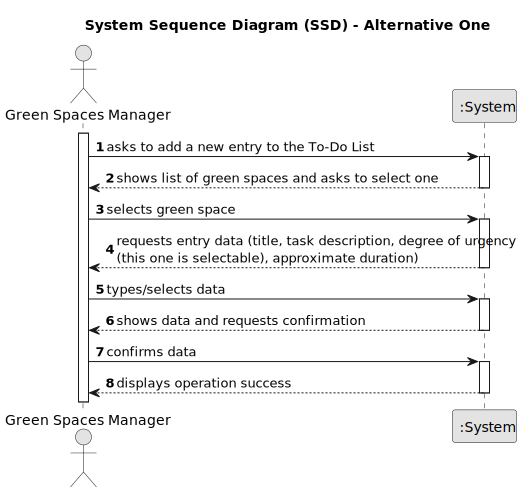

# US021 - Add an entry to the To-Do List

## 1. Requirements Engineering

### 1.1. User Story Description

As a Green Spaces Manager (GSM), I want to add a new entry to the To-Do List.

### 1.2. Customer Specifications and Clarifications 

**From the specifications document:**

>	The entries in this list describe the required task, the degree of urgency (High, Medium, and Low), and the approximate expected duration.

**From the client clarifications:**

> **Question:** Should the to-do entries be unique or can a GSM repeat the same to-do entry, for the same Green Space, multiple times?
>
> **Answer:** Yes; Assuming the previous task with same description was previously processed and is not open anymore.

> **Question:**  What are the details the GSM needs to input, other than the Green Space, frequency, estimated duration?Title and description are required?
>
> **Answer:** Title and description could be useful.

### 1.3. Acceptance Criteria

* **AC1:** The new entry must be associated with a green space managed by the GSM.
* **AC2:** The green space for the new entry should be chosen from a list presented to the GSM.

### 1.4. Found out Dependencies

* There is a dependency found in "US20 - Registering a Green Space and Its Area", as there must be one green space registered to associate to the entry.

### 1.5 Input and Output Data

**Input Data:**

* Selected data:
    * green space
    * degree of urgency

* Typed data:
    * title and task description
    * approximate duration

**Output Data:**

* (In)Success of the operation

### 1.6. System Sequence Diagram (SSD)

#### Alternative One

### 1.7 Other Relevant Remarks

* n/a