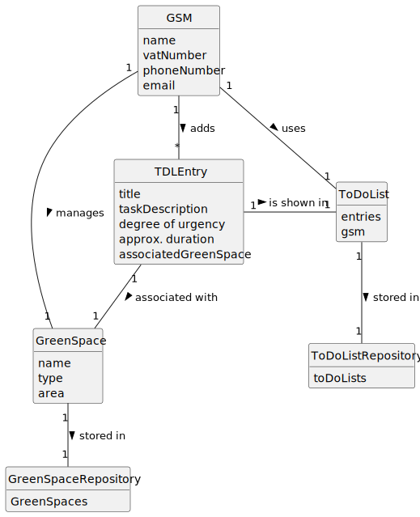

# US021 - Add an entry to the To-Do List

## 2. Analysis

### GSM (Green Spaces Manager):
* Responsible for adding entries to the To-Do List
* Attributes include name, vatNumber, phoneNumber, and email.

### TDLEntry:
* Added to the To-Do List by the GSM.
* Attributes include title/description, degree of urgency, approximate duration, and an associated Green Space.

### To-do List/TDList:
* Used by the GSM.
* Includes all entries created by the GSM.

### Green Space:
* Can be created by a GSM.
* Assigned to an entry in the To-Do List.
* Attributes include name, type and area.
*
### Green Space Repository:
* Stores Green Spaces and related information.
* 
### To-Do List Repository:
* Stores To-Do Lists.

### 2.1. Relevant Domain Model Excerpt 

### 2.2. Other Remarks

n/a