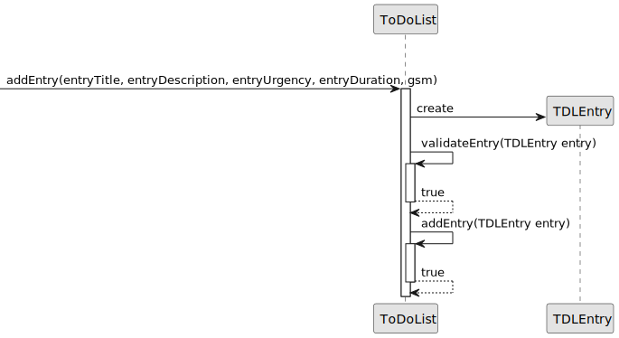
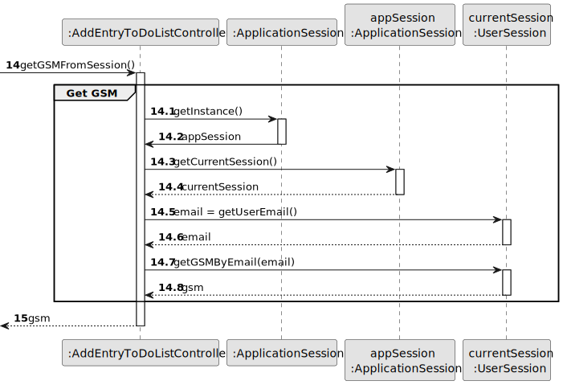
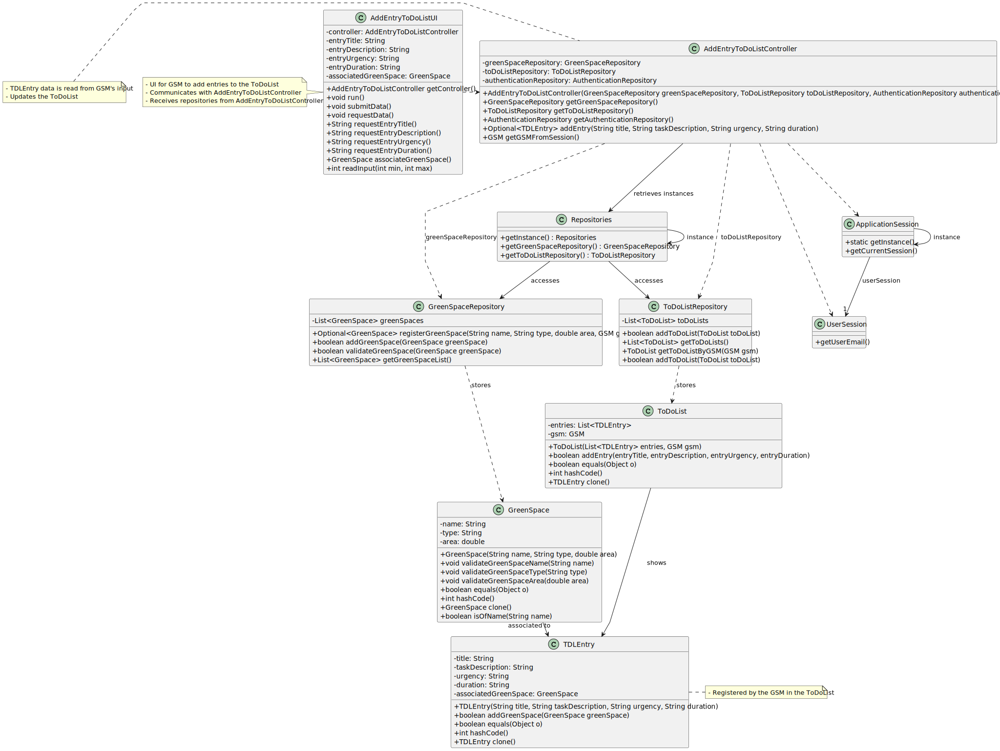

# US021 - Add an Entry to the To-Do List

## 3. Design - User Story Realization 

### 3.1. Rationale

_**Note that SSD - Alternative One is adopted.**_

| Interaction ID | Question: Which class is responsible for...    | Answer                                      | Justification (with patterns)                                                                                 |
|:---------------|:-----------------------------------------------|:--------------------------------------------|:--------------------------------------------------------------------------------------------------------------|
| Step 1  		     | 	... interacting with the actor?               | AddEntryToDoListUI                          | Pure Fabrication: there is no reason to assign this responsibility to any existing class in the Domain Model. |
| 			  		        | 	... coordinating the US?                      | AddEntryToDoListController                  | Controller                                                                                                    |
| 			  		        | 	... getting the GreenSpace List?              | AddEntryToDoListController                  | Controller                                                                                                    |
| 			  		        | ... knowing the user using the system?         | UserSession                                 | IE: cf. A&A component documentation.                                                                          |
| 			  		        | 							                                        | HRM                                         | IE: knows its own data (e.g. email)                                                                           |
| Step 2  		     | 	...showing list of Green Spaces?						        | AddEntryToDoListUI                          | IE: is responsible for all user interactions                                                                  |
| Step 3  		     | 	...getting the selected Green Space?          | AddEntryToDoListUI                          | IE: is responsible for all user interactions                                                                  |                                               
| Step 4  		     | 	...asking for the entry data?						           | AddEntryToDoListUI                          | IE: is responsible for all user interactions                                                                  |              
| Step 5  		     | 	...saving the inputted data?						            | AddEntryToDoListUI                          | IE: is responsible for all user interactions                                                                  |   
| Step 6  		     | 	...asking for confirmation?						             | AddEntryToDoListUI                          | IE: is responsible for all user interactions                                                                  |   
| Step 7 		      | 	... validating all data (local validation)?   | Entry                                       | IE: owns its data.                                                                                            |
| 			  		        | 	... validating all data (global validation)?  | ToDoList                                    | IE: stores all entries.                                                                                       |
| 			  		        | 	... getting the ToDoList for the current GSM? | AddEntryToDoListController                  | Controller                                                                                                    |
| 			  		        | 	... saving the created entry?                 | ToDoList                                    | IE: owns all entries.                                                                                         | 
| Step 8 		      | 	... informing operation success?              | AddEntryToDoListUI                          | IE: is responsible for user interactions.                                                                     |
### Systematization ##

According to the taken rationale, the conceptual classes promoted to software classes are: 

* GreenSpaceRepository
* ToDoListRepository
* Entry
* ToDoList

Other software classes (i.e. Pure Fabrication) identified: 

* AddEntryToDoListUI  
* AddEntryToDoListController

## 3.2. Sequence Diagram (SD)

_**Note that SSD - Alternative One is adopted.**_

### Full Diagram

This diagram shows the full sequence of interactions between the classes involved in the realization of this user story.

### Split Diagrams

## 3.3. Class Diagram (CD)

