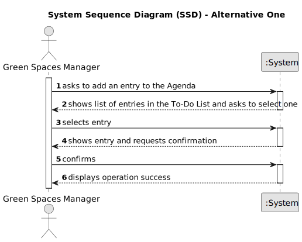

# US022 - Add an entry to the Agenda

## 1. Requirements Engineering

### 1.1. User Story Description

As a Green Space Manager (GSM), I want to add a new entry in the Agenda.

### 1.2. Customer Specifications and Clarifications 

**From the specifications document:**

>	The Agenda is made up of entries that relate to a task (which was previously in the To-Do List), the team that will carry out the task, the vehicles/equipment assigned to the task, expected duration, and the status (Planned, Postponed, Canceled, Done).

**From the client clarifications:**

> **Question:** During the last client meeting, we became aware that some tasks are meant to be reoccurring rather than occasional. Is this something that should be asked on creating the task in the to-do list? If so, what inputs should we expect from the user? The task's frequency in days?
>
> **Answer:** For the current proof-of-concept there is no need to distinguish between recurring and occasional tasks.

> **Question:** When the GSM plans a task (that was previously in To-Do) into the Agenda, what additional data/information does he need to input when planning?
>
> **Answer:** The starting date for the task.

### 1.3. Acceptance Criteria

* **AC1:** The new entry must be associated with a green space managed by the GSM.
* **AC2:** The new entry must exist in the To-Do list.

### 1.4. Found out Dependencies

* There is a dependency found in "US20 - Registering a Green Space and Its Area", as there must be one green space registered to associate to the entry.
* There is a dependency found in "US021 - Add an entry to the To-Do List", as there must be at least one entry present in the to-do list to carry out this User Story.

### 1.5 Input and Output Data

**Input Data:**

* Selected data:
    * the to-do list entry
    * the team/vehicles/equipment associated with the task

* Typed data:
    * expected duration

**Output Data:**

* (In)Success of the operation

### 1.6. System Sequence Diagram (SSD)

#### Alternative One

### 1.7 Other Relevant Remarks

* n/a