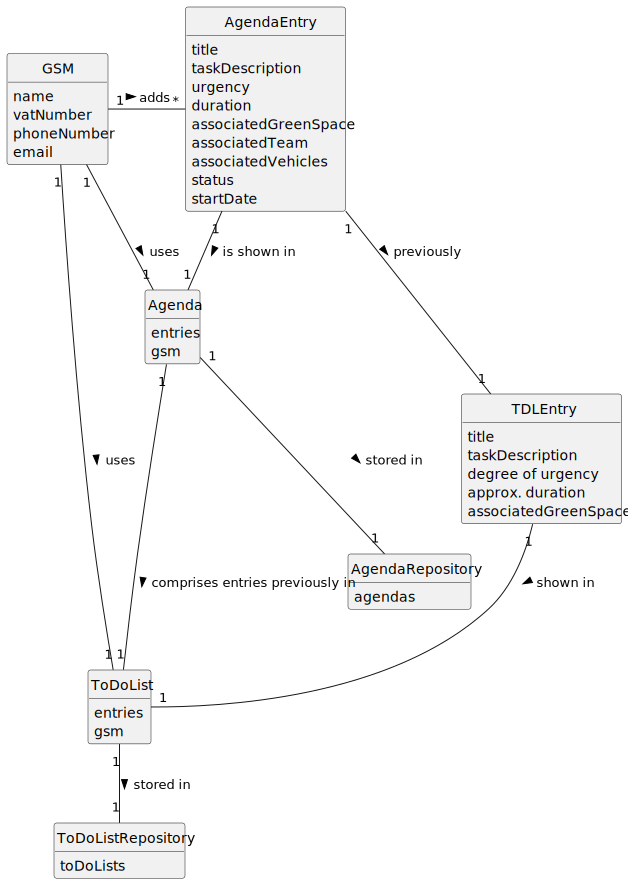

# US022 - Add an entry to the Agenda

## 2. Analysis

### GSM (Green Spaces Manager):
* Responsible for adding entries to the Agenda
* Attributes include name, vatNumber, phoneNumber, and email.

### AgendaEntry:
* Added to the Agenda by the GSM.
* Attributes include the team and the vehicles/equipment assigned to it, approximate duration, and status.
* Exists simultaneously in the To-Do List.

### Agenda:
* Used by the GSM.
* Includes entries created by the GSM that relate to a task.
* Comprises entries that were previously in the To-Do List.

### ToDoList
* Used by the GSM.
* Includes all pending entries created by the GSM.
* Some entries may exist in the Agenda.

### 2.1. Relevant Domain Model Excerpt

### 2.2. Other Remarks

n/a