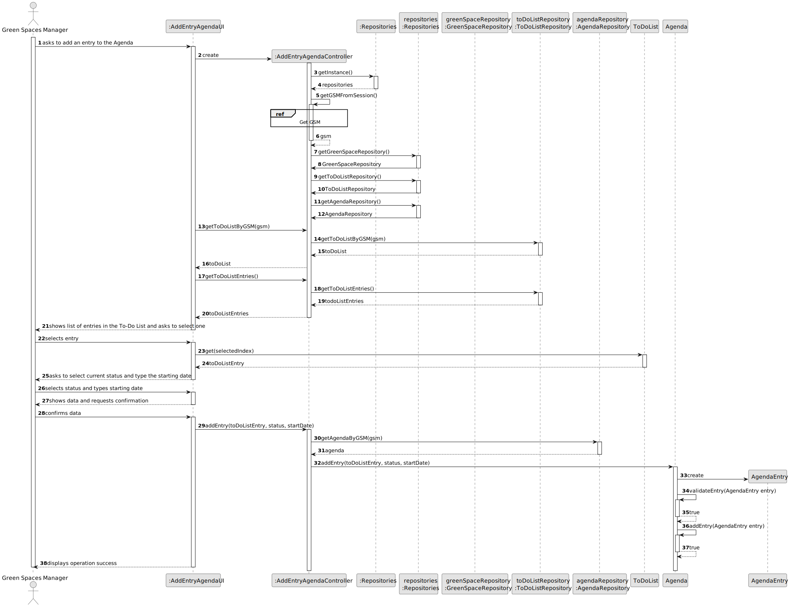
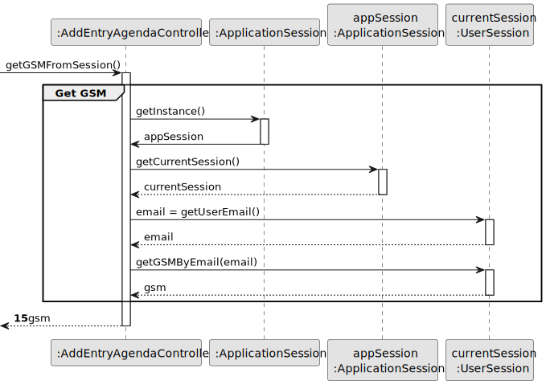
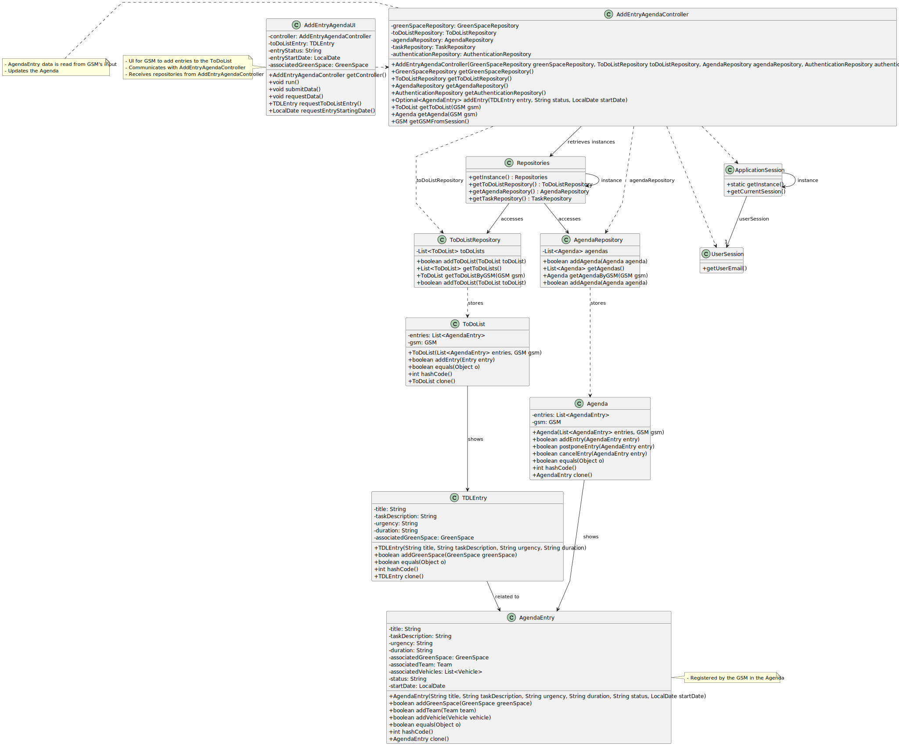

# US022 - Add an Entry to the Agenda

## 3. Design - User Story Realization 

### 3.1. Rationale

_**Note that SSD - Alternative One is adopted.**_

| Interaction ID | Question: Which class is responsible for...                     | Answer                   | Justification (with patterns)                                                                                 |
|:---------------|:----------------------------------------------------------------|:-------------------------|:--------------------------------------------------------------------------------------------------------------|
| Step 1  		     | 	... interacting with the actor?                                | AddEntryAgendaUI         | Pure Fabrication: there is no reason to assign this responsibility to any existing class in the Domain Model. |
| 			  		        | 	... coordinating the US?                                       | AddEntryAgendaController | Controller                                                                                                    |
| 			  		        | 	... getting the To-Do List for the current GSM?                | AddEntryAgendaController | Controller                                                                                                    |
| 			  		        | 	... getting the To-Do List entries?                            | AddEntryAgendaController | Controller                                                                                                    |
| 			  		        | ... knowing the user using the system?                          | UserSession              | IE: cf. A&A component documentation.                                                                          |
| 			  		        | 							                                                         | GSM                      | IE: knows its own data (e.g. email)                                                                           |
| Step 2  		     | 	...showing list of To-Do List entries?						                   | AddEntryAgendaUI         | IE: is responsible for all user interactions                                                                  |
| Step 3  		     | 	...getting the selected entry?                                 | AddEntryAgendaUI         | IE: is responsible for all user interactions                                                                  |                                               
| Step 4  		     | 	...asking for the entry data (status and starting date)?						 | AddEntryAgendaUI         | IE: is responsible for all user interactions                                                                  |              
| Step 5  		     | 	...saving the inputted data?						                             | AddEntryAgendaUI         | IE: is responsible for all user interactions                                                                  |   
| Step 6  		     | 	...asking for confirmation?						                              | AddEntryAgendaUI         | IE: is responsible for all user interactions                                                                  |   
| Step 7 		      | 	... validating all data (local validation)?                    | AgendaEntry              | IE: owns its data.                                                                                            |
| 			  		        | 	... validating all data (global validation)?                   | Agenda                   | IE: stores AgendaEntries.                                                                                     |
| 			  		        | 	... getting the Agenda for the current GSM?                    | AddEntryAgendaController | Controller                                                                                                    |
| 			  		        | 	... saving the created entry?                                  | Agenda                   | IE: owns AgendaEntries.                                                                                       | 
| Step 8 		      | 	... informing operation success?                               | AddEntryAgendaUI         | IE: is responsible for user interactions.                                                                     |
### Systematization ##

According to the taken rationale, the conceptual classes promoted to software classes are:
* AgendaRepository
* AgendaEntry
* Agenda

Other software classes (i.e. Pure Fabrication) identified: 

* AddEntryAgendaUI  
* AddEntryAgendaController

## 3.2. Sequence Diagram (SD)

_**Note that SSD - Alternative One is adopted.**_

### Full Diagram

This diagram shows the full sequence of interactions between the classes involved in the realization of this user story.

### Split Diagrams

## 3.3. Class Diagram (CD)

