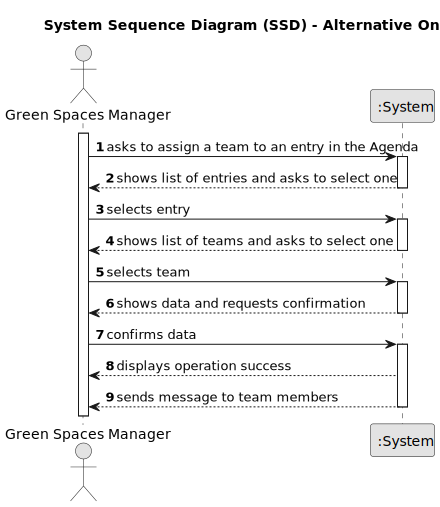

# US023 - Assign a Team

## 1. Requirements Engineering

### 1.1. User Story Description

As a Green Space Manager (GSM), I want to assign a Team to an entry in the Agenda.

### 1.2. Customer Specifications and Clarifications 

**From the specifications document:**

>	The Agenda is made up of entries that relate to a task (which was previously in the To-Do List), the team that will carry out the task, the vehicles/equipment assigned to the task, expected duration, and the status (Planned, Postponed, Canceled, Done).

**From the client clarifications:**

> **Question:** 
>
> **Answer:** No. The skill is to be created only.

> **Question:** What data is necessary to create a skill?
>
> **Answer:** At the moment, the skill is only a name.

### 1.3. Acceptance Criteria

* **AC1:** A message must be sent to all team members informing them about the assignment.
* **AC2:** Different email services can send the message. These services must be defined through a configuration file to allow the use of different platforms (e.g. Gmail, DEI’s email service, etc.).o modify the typed name.

### 1.4. Found out Dependencies

* There is a dependency on "US022 - Add an entry to the Agenda", as there must be at least one entry in the Agenda to assign a team to.
* There is a dependency on "US05 - Generate a Team", as there must be at least one team created to assign to an entry.

### 1.5 Input and Output Data

**Input Data:**

* Selected data:
    * the team to be assigned to the entry.

**Output Data:**

* (In)Success of the operation
* Message sent to the collaborators in the assigned team

### 1.6. System Sequence Diagram (SSD)

#### Alternative One

### 1.7 Other Relevant Remarks

* n/a