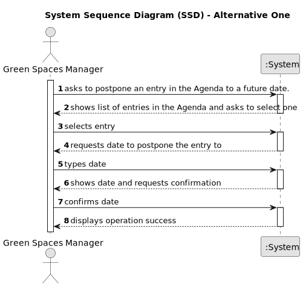

# US024 - Postpone an Entry in the Agenda

## 1. Requirements Engineering

### 1.1. User Story Description

As a Green Space Manager (GSM), I want to Postpone an entry in the Agenda to a specific future date.

### 1.2. Customer Specifications and Clarifications 

**From the specifications document:**

>	The Agenda is made up of entries that relate to a task (which was previously in the To-Do List), the team that will carry out the task, the vehicles/equipment assigned to the task, expected duration, and the status (Planned, Postponed, Canceled, Done).

**From the client clarifications:**

> **Question:** The selected task(s) will be postponed by one interval defined by the user or for the next day??
>
> **Answer:** When postponing a task, the new predicated date for execution should be inserted.

> **Question:** The date you want to postpone in this US24 is the date referring to the "approximate expected duration" field when we registered the task?
>
> **Answer:** No; sometimes, for various reasons (e.g. insufficient staff, faulty equipment or adverse weather conditions) a task has to be postponed to a new date; task duration is not directly related to this.

### 1.3. Acceptance Criteria

* n/a

### 1.4. Found out Dependencies

* There is a dependency on "US022 - Add an entry to the Agenda", as there must be at least one entry in the Agenda to postpone it.

### 1.5 Input and Output Data

**Input Data:**

* Selected data:
    * the entry to postpone

**Output Data:**

* (In)Success of the operation

### 1.6. System Sequence Diagram (SSD)

#### Alternative One

### 1.7 Other Relevant Remarks

* n/a