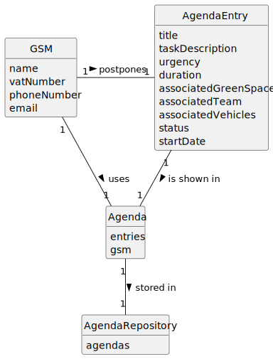

# US024 - Postpone an entry in the Agenda

## 2. Analysis

### GSM (Green Spaces Manager):
* Responsible for postponing entries in the Agenda
* Attributes include name, vatNumber, phoneNumber, and email.

### AgendaEntry:
* Postponed by the GSM.
* Attributes include the team and the vehicles/equipment assigned to it, approximate duration, and status.
* Exists simultaneously in the To-Do List.
* Has its status changed to "Postponed" after this US.

### Agenda:
* Used by the GSM.
* Includes entries that relate to a task.

### Agenda Repository:
* Stores Agendas.

### 2.1. Relevant Domain Model Excerpt

### 2.2. Other Remarks

n/a