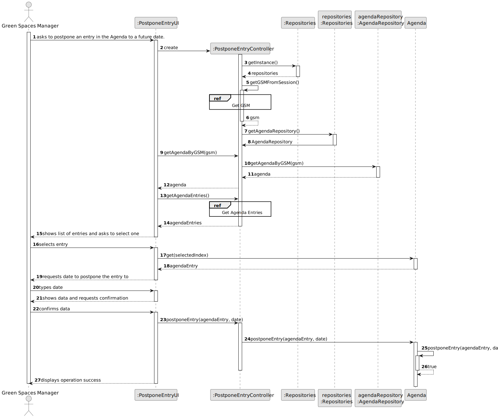
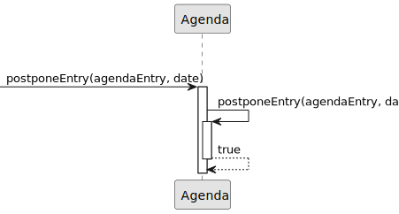
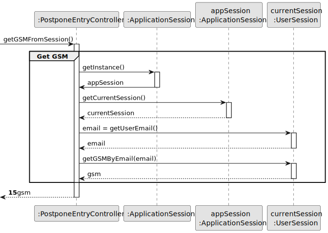
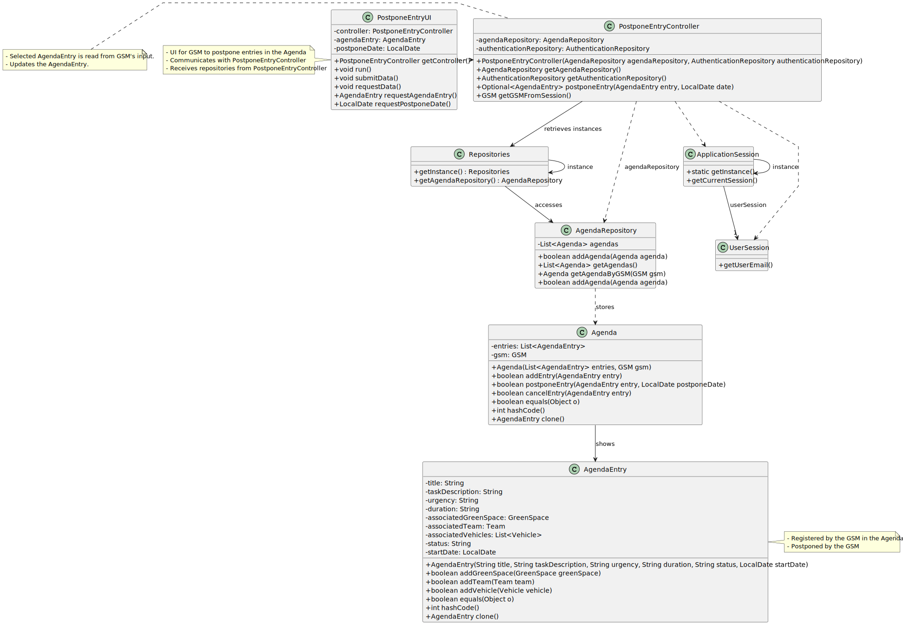

# US024 - Postpone an Entry

## 3. Design - User Story Realization 

### 3.1. Rationale

_**Note that SSD - Alternative One is adopted.**_

| Interaction ID | Question: Which class is responsible for...   | Answer               | Justification (with patterns)                                                                                 |
|:---------------|:----------------------------------------------|:---------------------|:--------------------------------------------------------------------------------------------------------------|
| Step 1  		     | 	... interacting with the actor?              | PostponeEntryUI         | Pure Fabrication: there is no reason to assign this responsibility to any existing class in the Domain Model. |
| 			  		        | 	... coordinating the US?                     | PostponeEntryController | Controller                                                                                                    |
| 			  		        | 	... getting the Agenda for the current GSM?  | PostponeEntryController | Controller                                                                                                    |
| 			  		        | 	... getting the Agenda entries?              | PostponeEntryController | Controller                                                                                                    |
| 			  		        | ... knowing the user using the system?        | UserSession          | IE: cf. A&A component documentation.                                                                          |
| 			  		        | 							                                       | GSM                  | IE: knows its own data (e.g. email)                                                                           |
| Step 2  		     | 	...showing list of Agenda entries?						     | PostponeEntryUI         | IE: is responsible for all user interactions                                                                  |
| Step 3  		     | 	...getting the selected entry?               | PostponeEntryUI         | IE: is responsible for all user interactions                                                                  |         
| Step 4  		     | 	...requesting the date to postpone to?						 | PostponeEntryUI         | IE: is responsible for all user interactions                                                                  |              
| Step 5  		     | 	...saving the typed date?						              | PostponeEntryUI         | IE: is responsible for all user interactions                                                                  |   
| Step 6  		     | 	...asking for confirmation?						            | PostponeEntryUI         | IE: is responsible for all user interactions                                                                  |   
| Step 7 		      | 	... validating all data (local validation)?  | AgendaEntry          | IE: owns its data.                                                                                            |
| 			  		        | 	... validating all data (global validation)? | Agenda               | IE: stores AgendaEntries.                                                                                     |
| 			  		        | 	... updating the entry?                      | Agenda               | IE: owns AgendaEntries.                                                                                       | 
| Step 8 		      | 	... informing operation success?             | PostponeEntryUI         | IE: is responsible for user interactions.                                                                     |

### Systematization ##

According to the taken rationale, the conceptual classes promoted to software classes are:

* AgendaEntry
* Agenda

Other software classes (i.e. Pure Fabrication) identified: 

* PostponeEntryUI  
* PostponeEntryController

## 3.2. Sequence Diagram (SD)

_**Note that SSD - Alternative One is adopted.**_

### Full Diagram

This diagram shows the full sequence of interactions between the classes involved in the realization of this user story.

### Split Diagrams

## 3.3. Class Diagram (CD)

