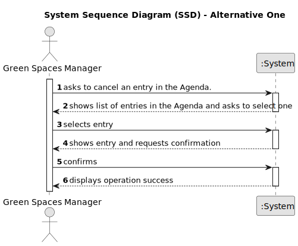

# US024 - Cancel an Entry in the Agenda

## 1. Requirements Engineering

### 1.1. User Story Description

As a Green Space Manager (GSM), I want to Cancel an entry in the Agenda to a specific future date.

### 1.2. Customer Specifications and Clarifications

**From the specifications document:**

>	The Agenda is made up of entries that relate to a task (which was previously in the To-Do List), the team that will carry out the task, the vehicles/equipment assigned to the task, expected duration, and the status (Planned, Postponed, Canceled, Done).

**From the client clarifications:**

> **Question:** When a task is cancelled, is it possible to put it back on the agenda again later?
>
> **Answer:** Yes.

> **Question:** When we cancel a task, do we move it again to the To-Do List?
>
> **Answer:** No.

### 1.3. Acceptance Criteria

* **AC1:** A cancelled task should not be deleted but rather change its state.

### 1.4. Found out Dependencies

* There is a dependency on "US022 - Add an entry to the Agenda", as there must be at least one entry in the Agenda to cancel it.

### 1.5 Input and Output Data

**Input Data:**

* Selected data:
  * the entry to cancel

**Output Data:**

* (In)Success of the operation

### 1.6. System Sequence Diagram (SSD)

#### Alternative One

### 1.7 Other Relevant Remarks

* n/a