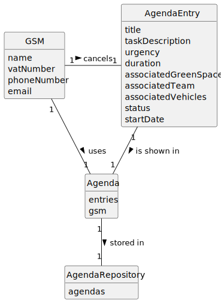

# US025 - Cancel an entry in the Agenda

## 2. Analysis

### GSM (Green Spaces Manager):
* Responsible for cancelling entries in the Agenda
* Attributes include name, vatNumber, phoneNumber, and email.

### Entry:
* Cancelled by the GSM.
* Attributes include the team and the vehicles/equipment assigned to it, approximate duration, and status.
* Exists simultaneously in the To-Do List.
* Has its status changed to "Cancelled" after this US. It is not actually deleted from the Agenda.

### Agenda:
* Used by the GSM.
* Includes all entries created by the GSM.

### 2.1. Relevant Domain Model Excerpt

### 2.2. Other Remarks

n/a