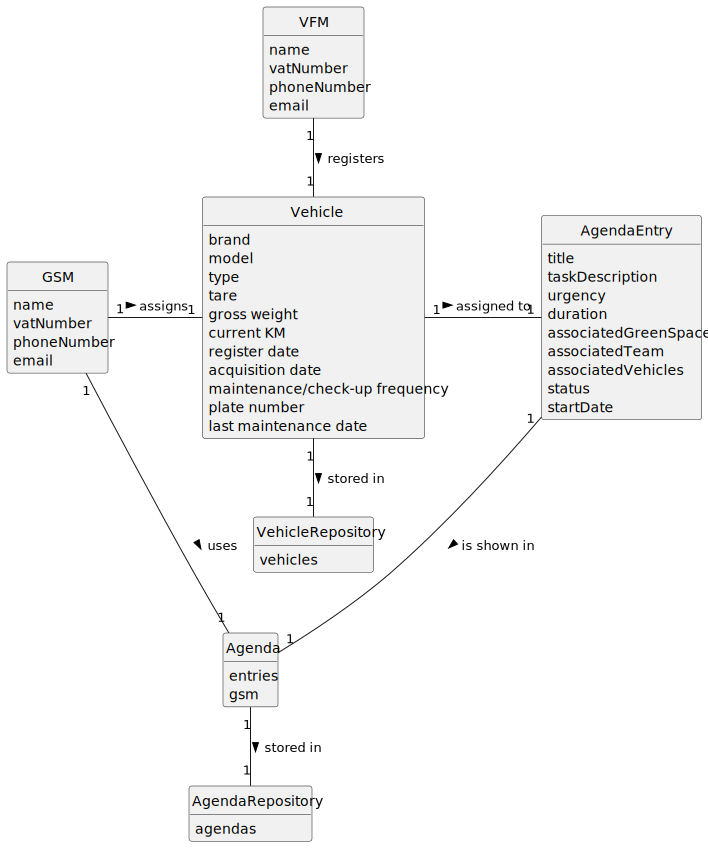

# US026 - Assign Vehicles to an entry in the Agenda

## 2. Analysis

### GSM (Green Spaces Manager):
* Responsible for assigning vehicles to entries in the Agenda
* Uses the Agenda
* Attributes include name, vatNumber, phoneNumber, and email.

### VFM (Human Resources Manager):
* Registers a vehicle that is then assigned to an entry in the Agenda
* Attributes include name, vatNumber, phoneNumber, and email.

### Vehicle:
* Registered by the VFM
* Assigned to an entry in the Agenda
* Attributes include Brand, Model, Type, Tare, Gross Weight, Current Km, Register Date, Acquisition Date, Maintenance/Check-up Frequency (in Kms), Plante Number and Last Maintenance Date.

### AgendaEntry:
* Added to the Agenda by the GSM.
* Attributes include the team and the vehicles/equipment assigned to it, approximate duration, and status.
* Existed previously in the To-Do List.

### Agenda:
* Used by the GSM.
* Includes all entries created by the GSM.

### Agenda Repository:
* Stores Agendas.

### Vehicle:
* Registered by the VFM.
* Assigned to an Entry in the Agenda by the GSM.
* Attributes include Brand, Model, Type, Tare, Gross Weight, Current Km, Register Date, Acquisition Date, Maintenance/Check-up Frequency (in Kms), Plate Number and Last Maintenance Date.

### Vehicle Repository:
* Stores registered vehicles.

### 2.1. Relevant Domain Model Excerpt

### 2.2. Other Remarks

n/a