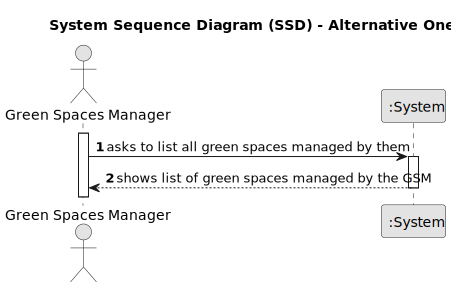

# US027 - List all managed Green Spaces

## 1. Requirements Engineering

### 1.1. User Story Description

As a Green Space Manager (GSM), I need to list all green spaces managed by me.

### 1.2. Customer Specifications and Clarifications 

**From the client clarifications:**

> **Question:** Which info about Green Spaces do you want the GSM see when listing?
>
> **Answer:** Each team can decide about the aspects related to UX/UI.

### 1.3. Acceptance Criteria

* **AC1:** The list of green spaces must be sorted by size in descending order. The sorting algorithm to be used by the application must be defined through a configuration file. At least two sorting algorithms should be available.

### 1.4. Found out Dependencies

* There is a dependency found in "US20 - Registering a Green Space and Its Area", as there must be one green space registered to carry out the User Story.

### 1.5 Input and Output Data

**Input Data:**

n/a

**Output Data:**

* List of Green Spaces

### 1.6. System Sequence Diagram (SSD)

#### Alternative One

### 1.7 Other Relevant Remarks

* n/a