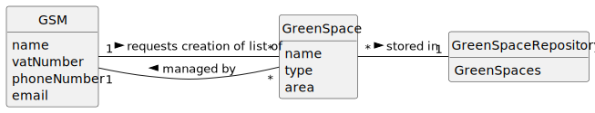

# US027 - List all managed Green Spaces

## 2. Analysis

### GSM (Green Spaces Manager):
* Responsible for registering Green Spaces.
* Requests list of Green Spaces managed by them.
* Attributes include name, vatNumber, phoneNumber, and email.

### Green Space:
* Can be created and is managed by a GSM.
* Attributes include name, type and area.
* 
### Green Space Repository:
* Stores Green Spaces and related information.
* Filters Green Spaces to show on the list.

### 2.1. Relevant Domain Model Excerpt 

### 2.2. Other Remarks

n/a