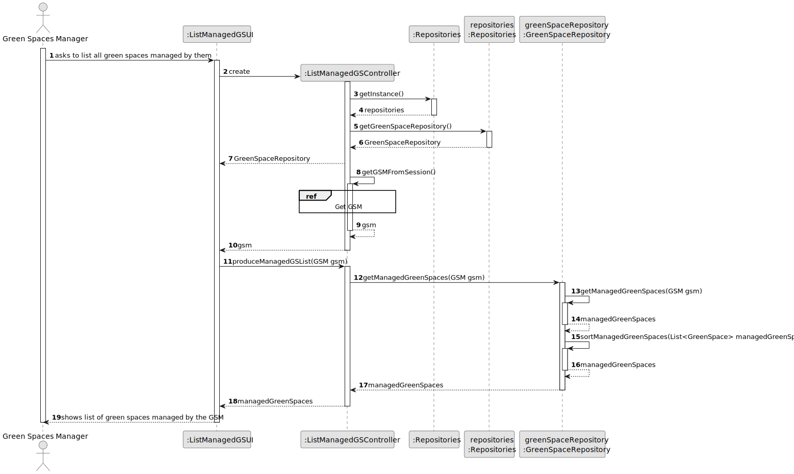
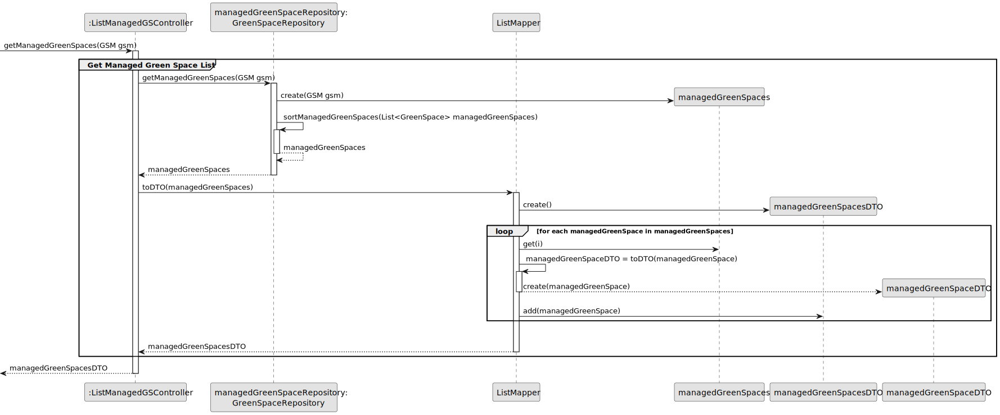
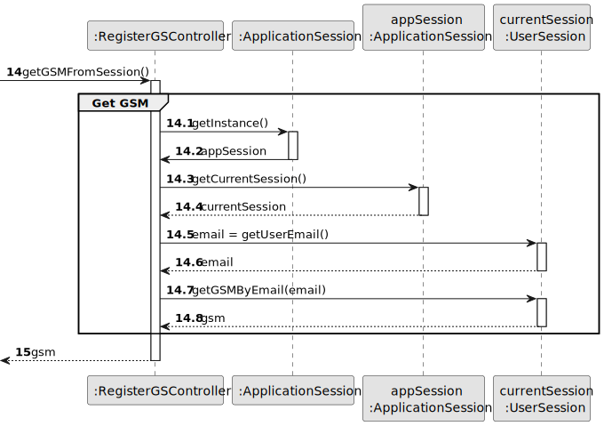
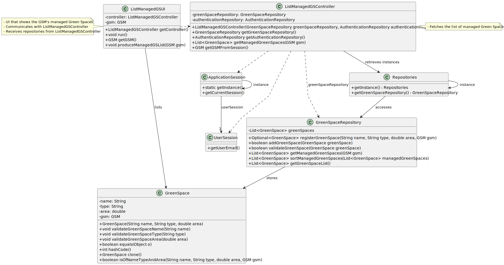

# US027 - List Managed Green Spaces

## 3. Design - User Story Realization 

### 3.1. Rationale

_**Note that SSD - Alternative One is adopted.**_

| Interaction ID | Question: Which class is responsible for...             | Answer                  | Justification (with patterns)                                                                                 |
|:---------------|:--------------------------------------------------------|:------------------------|:--------------------------------------------------------------------------------------------------------------|
| Step 1  		     | 	... interacting with the actor?                        | ListManagedGSUI         | Pure Fabrication: there is no reason to assign this responsibility to any existing class in the Domain Model. |
| 			  		        | 	... coordinating the US?                               | ListManagedGSController | Controller                                                                                                    |
| 			  		        | 	... creating the List?                                 | GreenSpaceRepository       | Creator (Rule 1): in the DM the Repository produces the List                                                  |
| 			  		        | ... knowing the user using the system?                  | UserSession             | IE: cf. A&A component documentation.                                                                          |
| 			  		        | 							                                                 | GSM                     | IE: knows its own data (e.g. email)                                                                           |
| Step 2  		     | ... getting the Green Spaces managed by the GSM?							 | GreenSpaceRepository       | IE: Stores all information related to green spaces                                                            |
|   		           | ... sorting the Green Spaces by size?							            | GreenSpaceRepository       | Repository: responsible for sorting the Green Spaces according to the configuration file                      |
|   		           | ... showing the List?							                            | ListManagedGSUI         | IE: responsible for User interactions                                                                         |
### Systematization ##

According to the taken rationale, the conceptual classes promoted to software classes are: 

* GreenSpaceRepository
* GreenSpace

Other software classes (i.e. Pure Fabrication) identified: 

* ListManagedGSUI  
* ListManagedGSController

## 3.2. Sequence Diagram (SD)

_**Note that SSD - Alternative One is adopted.**_

### Full Diagram

This diagram shows the full sequence of interactions between the classes involved in the realization of this user story.

### Split Diagrams

## 3.3. Class Diagram (CD)

