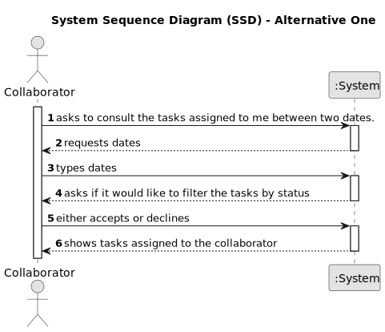

# US028 - Consult Tasks

## 1. Requirements Engineering

### 1.1. User Story Description

As a Collaborator, I wish to consult the tasks assigned to me.

### 1.2. Customer Specifications and Clarifications 

**From the specifications document:**

>	The Agenda is made up of entries that relate to a task (which was previously in the To-Do List), the team that will carry out the task, the vehicles/equipment assigned to the task, expected duration, and the status (Planned, Postponed, Canceled, Done).

**From the client clarifications:**

> **Question:** Could a task belong to different teams and collaborators?
>
> **Answer:** No. Maybe a distinction should be made between the type of task and a task. (Task type is "Prunning trees", a specific task is "Prunning trees" in specific park in a specific date.)

> **Question:** Are the tasks that should be shown to the Collaborator in this US where the starting date is between the two mentioned by the Collaborator?
>
> **Answer:** I would suggest to consider any tasks which intercept the supplied period (defined by the two dates).

### 1.3. Acceptance Criteria

* **AC1:** The list of green spaces must be sorted by date, starting with the first to be performed

### 1.4. Found out Dependencies

* There is a dependency on "US022 - Add an entry to the Agenda" and "US023 - Assign a Team", as there must be at least one entry in the Agenda with a Team assigned to it to consult the tasks.

### 1.5 Input and Output Data

**Input Data:**

* Typed Data:
  * dates

* Selected Data:
  * status filter

**Output Data:**

* List of tasks

### 1.6. System Sequence Diagram (SSD)

#### Alternative One

### 1.7 Other Relevant Remarks

* n/a