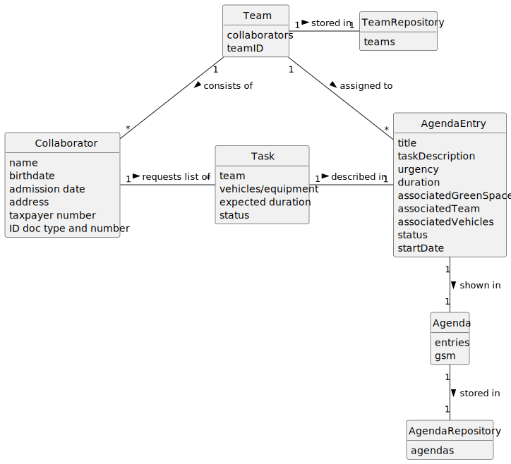

# US028 - Consult Tasks 

## 2. Analysis

### Collaborator:
* Is registered by HRM(s).
* Might be assigned to a Team
* Asks to show list of tasks which they are assigned to
* Attributes include name, birthdate, admission date, address, contact info (mobile and email), taxpayer number, ID doc type and a respective number.

### Entry:
* Added to the Agenda by the GSM.
* Attributes include the team and the vehicles/equipment assigned to it, approximate duration, and status.
* Exists simultaneously in the To-Do List.
* Might be included in the list asked by the Collaborator

### Agenda:
* Used by the GSM.
* Includes all entries created by the GSM.

### 2.1. Relevant Domain Model Excerpt 

### 2.2. Other Remarks

n/a