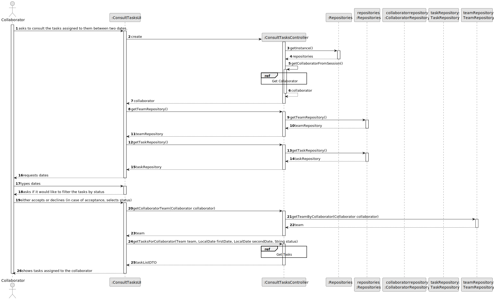
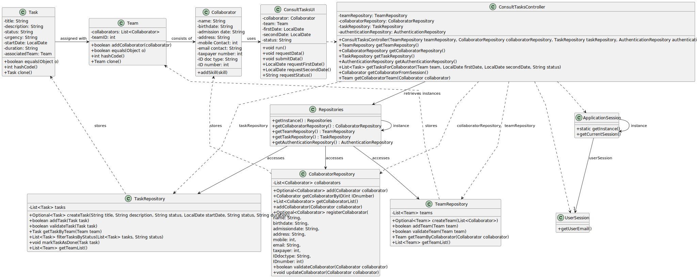

# US028 - Consult Tasks

## 3. Design - User Story Realization

### 3.1. Rationale

_**Note that SSD - Alternative One is adopted.**_

| Interaction ID | Question: Which class is responsible for...             | Answer                 | Justification (with patterns)                                                                                 |
|:---------------|:--------------------------------------------------------|:-----------------------|:--------------------------------------------------------------------------------------------------------------|
| Step 1  		     | 	... interacting with the actor?                        | ConsultTasksUI         | Pure Fabrication: there is no reason to assign this responsibility to any existing class in the Domain Model. |
| 			  		        | 	... coordinating the US?                               | ConsultTasksController | Controller                                                                                                    |
| 			  		        | 	... instantiating the repositories?                    | ConsultTasksController | Controller                                                                                                    |
| 			  		        | 	... getting the repositories?                          | Repositories           | Stores all repositories                                                                                       |
| 			  		        | ... knowing the user using the system?                  | UserSession            | IE: cf. A&A component documentation.                                                                          |
| 			  		        | 							                                                 | Collaborator           | IE: knows its own data (e.g. email)                                                                           |
| Step 2  		     | 	...requesting the dates?						                         | ConsultTasksUI         | IE: is responsible for all user interactions                                                                  |
| Step 3  		     | 	...saving the inputted dates?                          | ConsultTasksUI         | IE: is responsible for all user interactions                                                                  |
| Step 4  		     | 	...asking if the user wants to filter by status?						 | ConsultTasksUI         | IE: is responsible for all user interactions                                                                  |              
| Step 5  		     | 	...saving the inputted status? (optional) 						       | ConsultTasksUI         | IE: is responsible for all user interactions                                                                  |   
| 			  		        | ... getting the team the collaborator is in?							     | TeamRepository         | IE: stores teams and all related info.                                                                        |
| 			  		        | ... creating a list of tasks?							                    | TaskRepository         | IE: stores tasks and all related info.                                                                        |
| 			  		        | ... transforming the list into a DTO?							            | ListMapper             | IE: responsible for transforming objects into DTOs                                                            |
| Step 6  		     | 	...showing the list of tasks?				                      | ConsultTasksUI         | IE: is responsible for all user interactions                                                                  |

### Systematization ##

According to the taken rationale, the conceptual classes promoted to software classes are:

* ListMapper

Other software classes (i.e. Pure Fabrication) identified:

* ConsultTasksUI
* ConsultTasksController

## 3.2. Sequence Diagram (SD)

_**Note that SSD - Alternative One is adopted.**_

### Full Diagram

This diagram shows the full sequence of interactions between the classes involved in the realization of this user story.

### Split Diagrams

## 3.3. Class Diagram (CD)

