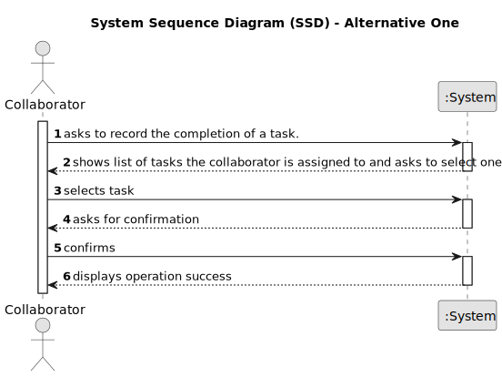

# US029 - Record Completion of Task

## 1. Requirements Engineering

### 1.1. User Story Description

As a Collaborator, I want to record the completion of a task.

### 1.2. Customer Specifications and Clarifications 

**From the specifications document:**

>	The Agenda is made up of entries that relate to a task (which was previously in the To-Do List), the team that will carry out the task, the vehicles/equipment assigned to the task, expected duration, and the status (Planned, Postponed, Canceled, Done).

**From the client clarifications:**

> **Question:** When a collaborator records a task, should the system ask for any observations regarding the completed task?
>
> **Answer:** Maybe if optional, not mandatory.

> **Question:** This "record" refers to the act of only changing the status of the task, or do we want to save a list of the completed tasks within each Collaborator?
>
> **Answer:** It means to record that a task was completed (changing the status) with the finish time.

### 1.3. Acceptance Criteria

n/a

### 1.4. Found out Dependencies

* There is a dependency on "US022 - Add an entry to the Agenda" and "US023 - Assign a Team", as there must be at least one entry in the Agenda with a Team assigned to it to mark it as completed

### 1.5 Input and Output Data

**Input Data:**

* Selected data:
    * the task

**Output Data:**

* (In)Success of the operation

### 1.6. System Sequence Diagram (SSD)

#### Alternative One

### 1.7 Other Relevant Remarks

* The task has to be in "Planned" status.