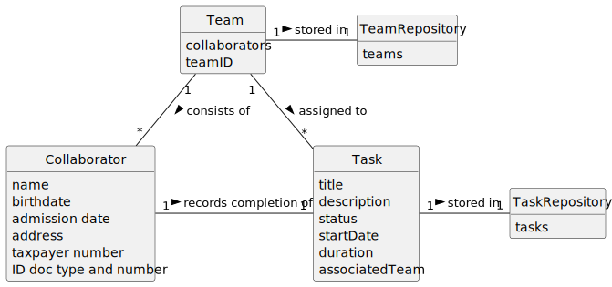

# US029 - Record Completion of Task

## 2. Analysis

### Collaborator:
* Is registered by HRM(s).
* Might be assigned to a Team
* Asks to record a task which they are assigned to
* Attributes include name, birthdate, admission date, address, contact info (mobile and email), taxpayer number, ID doc type and a respective number.

### Team:
* Generated by the HRM.
* Assigned to an entry in the Agenda.
* Consists of collaborators.

### Task:
* Part of an AgendaEntry.
* Attributes include title, description, status, startDate, duration, and an associated Team

### Team Repository:
* Stores teams and related information

### Task Repository:
* Stores tasks and related information

### 2.1. Relevant Domain Model Excerpt

### 2.2. Other Remarks

n/a