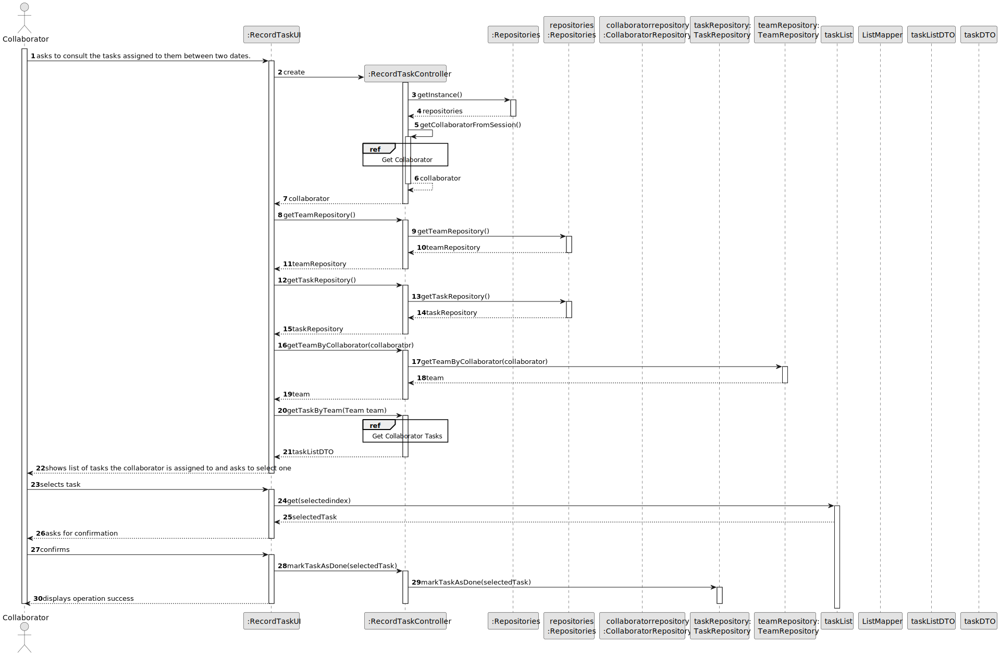

# US029 - Record Completion of Task

## 3. Design - User Story Realization

### 3.1. Rationale

_**Note that SSD - Alternative One is adopted.**_

| Interaction ID | Question: Which class is responsible for...            | Answer               | Justification (with patterns)                                                                                 |
|:---------------|:-------------------------------------------------------|:---------------------|:--------------------------------------------------------------------------------------------------------------|
| Step 1  		     | 	... interacting with the actor?                       | RecordTaskUI         | Pure Fabrication: there is no reason to assign this responsibility to any existing class in the Domain Model. |
| 			  		        | 	... coordinating the US?                              | RecordTaskController | Controller                                                                                                    |
| 			  		        | 	... instantiating the repositories?                   | RecordTaskController | Controller                                                                                                    |
| 			  		        | 	... getting the repositories?                         | Repositories         | Stores all repositories                                                                                       |
| 			  		        | ... getting the team the collaborator is in?							    | TeamRepository       | IE: stores teams and all related info.                                                                        |
| 			  		        | ... getting and filtering the list of tasks?							    | TaskRepository       | IE: stores tasks and all related info.                                                                        |
| 			  		        | ... transforming the list into a DTO?							           | TaskRepository       | IE: stores tasks and all related info.                                                                        |
| 			  		        | ... knowing the user using the system?                 | UserSession          | IE: cf. A&A component documentation.                                                                          |
| 			  		        | 							                                                | Collaborator         | IE: knows its own data (e.g. email)                                                                           |
| Step 2  		     | 	...requesting the task to change the status of?						 | RecordTaskUI         | IE: is responsible for all user interactions                                                                  |
| Step 3  		     | 	...saving the selected task?                          | RecordTaskUI         | IE: is responsible for all user interactions                                                                  |
| Step 4  		     | 	...asking for confirmation?						                     | RecordTaskUI         | IE: is responsible for all user interactions                                                                  |              
| Step 5  		     | 	...changing the status of the selected task? 						   | TaskRepository       | IE: stores tasks and all related info.                                                       |
| Step 6  		     | 	...displaying operation success?				                  | RecordTaskUI         | IE: is responsible for all user interactions                                                                  |

### Systematization ##

According to the taken rationale, the conceptual classes promoted to software classes are:

* TaskRepository

Other software classes (i.e. Pure Fabrication) identified:

* RecordTaskUI
* RecordTaskController

## 3.2. Sequence Diagram (SD)

_**Note that SSD - Alternative One is adopted.**_

### Full Diagram

This diagram shows the full sequence of interactions between the classes involved in the realization of this user story.

### Split Diagrams

## 3.3. Class Diagram (CD)

