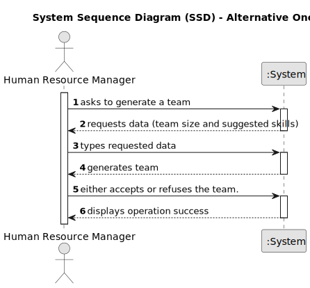

# US005 - Generate a Team 

## 1. Requirements Engineering

### 1.1. User Story Description

As a HRM, I want to generate a team proposal automatically.

### 1.2. Customer Specifications and Clarifications 

**From the specifications document:**

>	Each team is generated according to the team size and suggested skills provided by the HRM.

**From the client clarifications:**

> **Question:** How does the program generate a team if there are not enough employees?
>
> **Answer:** The program should provide information as to why it can't generate a team.

> **Question:** What if the team is inadequate for the task at hand?
>
> **Answer:** The systems provide team proposals and the HRM can accept or refuse the proposals. In the future (not in this sprint), the HRM may decide to edit the team.

### 1.3. Acceptance Criteria

* **AC1:** The maximum team size and the set of skills need to be supplied by the HRM.
* **AC2:** The user must be allowed to either accept or refuse the generated team.

### 1.4. Found out Dependencies

* There is a dependency on "US004 - Assign a Skill" - as there must be at least one skill attributed to a collaborator - "US003 - Register a collaborator" - as there must already be at least one collaborator registered within the system - "US002 - Create a Job" - as there must already exist a job to create a team for.

### 1.5 Input and Output Data

**Input Data:**

* Typed data:
    * team size (number)
    * one or more skill names
	
* Selected data:
  n/a

**Output Data:**

* Generated Team

### 1.6. System Sequence Diagram (SSD)

**_Other alternatives might exist._**

#### Alternative One

### 1.7 Other Relevant Remarks

 n/a